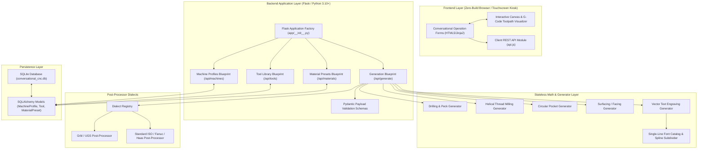

# Conversational CNC Controller: Architecture & Technical Specification

## 1. System Overview & Philosophy

The **Conversational CNC Controller** is a lightweight, web-based, locally executing machining application designed to bridge the gap between complex CAD/CAM software and quick, on-the-fly workshop machining.

### Core Principles
1. **Zero-Build-Step Deployment**: Server-rendered HTML5 templates + vanilla ES6 JavaScript with no Node.js, Webpack, or npm dependencies. Instant offline execution on low-power devices like Raspberry Pi 4/5 touchscreen kiosks or desktop workstations.
2. **Stateless Deterministic Generators**: All G-code calculations are executed by pure Python functions with zero database or web framework dependencies. Given the exact same numerical parameters, generators produce identical, mathematically verified toolpaths.
3. **Controller Dialect Abstraction**: An extensible post-processor registry adapts toolpath commands to target controllers (e.g. expanding canned cycles into linear/rapid moves for Grbl, or emitting native `G81-G83` canned cycles for LinuxCNC/Fanuc/Haas).
4. **Tool Safety & Machine Envelope Guard**: Every toolpath is validated against the active machine's physical travel boundaries with bounding box warnings and physical soft limits checks.

---

## 2. System Architecture & Component Diagram

---

## 3. Conversational Machining Engines

### 3.1. Straight Plunge & Peck Drilling (`app/generators/drilling.py`)
- **Straight Plunge**: Computes linear approach, plunge at feed rate, optional bottom dwell (`G04`), and rapid retract (`G00`) for single holes and multi-hole lists.
- **Peck Drilling**: Supports two industry-standard pecking algorithms:
  - `G83 Deep Hole`: Full retract to safe clearance Z on each peck for chip clearing.
  - `G73 Chip Break`: Small $0.5\text{mm}$ retract lift to break continuous chip ribbons without fully exiting the hole.
- **Grbl Expansion**: Because Grbl does not support canned cycles, the generator calculates and unrolls all intermediate plunges, dwell pauses, and retracts directly into atomic `G0`/`G1` motion blocks.

### 3.2. Helical Thread Milling (`app/generators/thread_milling.py`)
- **Helical Interpolation**: 3D simultaneous circular motion ($X, Y$) with synchronized $Z$ pitch descent ($Z = Z_{\text{start}} - \text{Pitch} \cdot \theta / 2\pi$).
- **Geometry Modes**:
  - **Internal Tapped Holes**: Climb milling from bottom of hole upwards ($Z_{\text{bottom}} \to Z_{\text{top}}$) to eject chips cleanly.
  - **External Threaded Studs**: Climb milling from top of stud downwards ($Z_{\text{top}} \to Z_{\text{bottom}}$).
- **Lead-In & Lead-Out**: 180° semi-circular tangential helical arc transitions to eliminate tool dwell gouging.
- **Radial Multipass Stepping**: Multi-pass roughing passes plus zero-cut spring passes to combat tool deflection.
- **Thread Standards Catalog**: Built-in dimensional database for Metric ISO (M2 to M20 coarse/fine) and Imperial UN (UNC #2-56 to 3/4-10, UNF #10-32 to 1/2-20).

### 3.3. Circular Pocketing & Helical Boring (`app/generators/circular_pocket.py`)
- **Concentric Radial Stepover**: Smooth concentric clearing passes expanding outward from center.
- **Entry Strategies**: Plunge or Helical ramp entry with configurable ramp angle.
- **Perimeter Finish Pass**: Independent wall finishing pass with clean overlap to remove tool marks.

### 3.4. Workpiece & Spoilboard Surfacing (`app/generators/surfacing.py`)
- **Raster Strategies**:
  - `Zig-Zag (Bidirectional)`: Continuous cutting in both $+X$ and $-X$ directions for maximum material removal speed.
  - `Climb One-Way (Unidirectional)`: Cuts in climb direction, rapids back at safe Z clearance for maximum surface finish quality.
- **Overtravel & Overlap**: Configurable cutter overtravel past workpiece edges and stepover percentage ($10\%\text{--}90\%$).
- **Datum Reference Modes**: Center origin $(X_c, Y_c)$ or Bottom-Left corner $(X_0, Y_0)$.

### 3.5. Single-Line Vector Text Engraving (`app/generators/engraving.py` & `engraving_font.py`)
- **Layout Modes**:
  - `Linear Layout`: Supports multi-line text (`\n`), arbitrary rotation angle $\theta$, and alignment (`left`, `center`, `right`).
  - `Arc / Circular Layout`: Polar wrapping along circular pitch radius $R$, center $(X_c, Y_c)$, start/center angle, and wrap direction (clockwise top arc vs. counter-clockwise bottom arc).
- **Font Catalog**: 5 custom single-line stroke fonts:
  1. `simplex_sans`: Clean single-stroke sans-serif.
  2. `duplex_sans`: Bold double-stroke sans-serif with parallel offset toolpaths.
  3. `roman_serif`: Classic Roman formal serif lettering with base feet.
  4. `cursive_script`: Elegant flowing script with cursive flourishes.
  5. `block_stencil`: Industrial 45° chamfered octagonal block lettering.
- **Parametric Curve Interpolation & Smoothing**:
  - Cubic Catmull-Rom spline subdivision with **sharp-corner preservation** (angles $\ge 65^\circ$ remain sharp, while curved loops and circles are subdivided into smooth continuous paths).
  - Configurable sampling multiplier ($1\times$ coarse, $2\times$ medium, $4\times$ smooth, $8\times$ fine, $12\times$ ultra-smooth).
- **Tool Tip Flat Calculation**: Computes live surface cut width based on V-bit angle $\theta$, tip flat width $W_{\text{tip}}$, and cutting depth $d$:
  $$W_{\text{cut}} = W_{\text{tip}} + 2d\tan(\theta/2)$$

### 3.6. Rectangular Pocket & Boss / Island Machining (`app/generators/rectangular_pocket.py`)
- **Rectangular Pocket**: Concentric clearing loops with corner fillets ($R_c$), helical ramp entry, customizable stepover percentage, and a dedicated perimeter wall finishing contour pass with tangential lead-in/out.
- **Boss / Raised Island Machining**: Clears the outer perimeter area between the stock boundary and a precision raised rectangular island feature.

### 3.7. Linear Slotting & Keyways (`app/generators/slotting.py`)
- **Linear Slots**: Cuts straight slots between arbitrary coordinates $(X_1, Y_1)$ and $(X_2, Y_2)$ with depth stepdowns, centerline cutting (when $W_{\text{slot}} = D_{\text{tool}}$) or automated side clearing passes (when $W_{\text{slot}} > D_{\text{tool}}$).

### 3.8. 2D Chamfering & Edge Breaking (`app/generators/chamfering.py`)
- **Edge Deburring & Chamfering**: Calculates exact tip offset and plunge depth ($Z = -(W_{\text{chamfer}}/\tan(\theta/2) + d_{\text{tip}})$) for conical 45°, 60°, 90°, and 120° V-bits / chamfer mills along outer perimeter or pocket edges.

---

## 4. Machine Profiles & Router Spindle Management

### 4.1. Router Speed Dial Mapping
For CNC machines utilizing manual trim routers (such as the DeWalt DWP611), spindle speeds cannot be controlled via PWM/VFD. The system provides:
- **Discrete Dial Mapping**:
  - Dial 1: 16,000 RPM
  - Dial 2: 18,200 RPM
  - Dial 3: 20,400 RPM
  - Dial 4: 22,600 RPM
  - Dial 5: 24,800 RPM
  - Dial 6: 27,000 RPM
- **RPM Clamping & Operator Instructions**: Automatically clamps speeds below 16k RPM and injects explicit human-readable dial setup instructions in G-code program headers.

### 4.2. Tool Library & Material Presets
- **Tools**: Stores tool number, name, type (endmill, ball, V-bit, thread mill, flycutter), diameter, flute count, and flute length.
- **Material Presets**: Stores material-specific parameters (spindle RPM, feed rate XY, plunge feed, max stepdown Z, stepover %) attached to specific tools for woods, plastics, brass, and aluminum.

---

## 5. Visualizer & G-Code Simulation Engine

The client-side visualizer (`app/static/js/visualizer.js`) provides an interactive 2D/3D toolpath simulation engine:

1. **3D Isometric Orbit Viewport**:
   - Projected 3D coordinate space with mouse drag orbit (pitch/yaw), camera angle presets (Isometric, Top XY, Front XZ, Right YZ), auto-fit scaling, and machine envelope soft limits wireframe.
2. **Animated Toolpath Playback**:
   - Step-by-step cutter animation along toolpaths with Play/Pause, Step Forward/Backward, progress scrubber slider, speed multipliers ($0.5\times$ to $10\times$), and live coordinates HUD ($X, Y, Z$, Feed, Step count).
3. **Bi-Directional Selection Sync**:
   - Clicking any line in the interactive G-code editor jumps the 3D cutter tool directly to that position and highlights the active motion vector in glowing yellow (`#facc15`).

---

## 6. Plain English G-Code Hints & Modal State Inspector

Implemented in `app/static/js/gcode_inspector.js`:
1. **Plain English Explainer**: Decodes G-code blocks (linear feeds, helical arcs, dwells, canned cycles) into crystal-clear conversational explanations with calculated travel distance, arc center coordinates, and Z-pitch descent.
2. **Live Modal State Dashboard**: Real-time modal registers (`WCS`, `Plane`, `Units`, `Distance Mode`, `Motion`, `Tool`, `Spindle`, `Feed`).

---

## 7. G-Code Transformations & Multi-Tool Splitter

Implemented in `app/generators/transformations.py`:
1. **Coordinate Shift / Offsets**: Translates coordinates by $(\Delta X, \Delta Y, \Delta Z)$ for multi-fixture work setups.
2. **Rotation**: Rotates toolpaths in the $XY$ plane around arbitrary pivot centers $(X_c, Y_c)$ with arc center vector ($I, J$) rotation.
3. **Mirroring with Automatic Arc Reversal**: Mirrors across $X$ or $Y$ axis and automatically flips arc directions ($G2 \leftrightarrow G3$).
4. **Feed & Speed Override Adjuster**: Global percentage scaling for feed rates and spindle speeds.
5. **Multi-Tool Program Splitter**: Extracts multi-tool jobs (`M6 T...`) into individual standalone `.nc` programs per tool with safe retracts and footers.

---

## 8. Physics-Based Feeds & Speeds Engine

Implemented in `app/generators/feeds_speeds.py`:
1. **Radial Chip Thinning Factor (RCTF)**: Compares radial stepover $W$ against tool diameter $D$. When $W < 0.5D$, compensates chip load ($\text{RCTF} = \frac{1}{2\sqrt{(W/D) - (W/D)^2}}$) to prevent cutter rubbing.
2. **Material Removal Rate (MRR) & Power Calculation**: Calculates volume removal rate ($\text{cm}^3/\text{min}$) and estimates required spindle cutting power (kW/HP) using material-specific specific cutting energy ($K_p$).
3. **Deflection Warning Advisor**: Flags high tool stickout ratios ($> 4.5\times$ diameter) and power overloads.

---

## 9. Machine Probing, Homing & WCS Zeroing Architecture

Implemented in `app/generators/probing.py`:
1. **2-Stage Z-Touch Plate Probing**: Fast search probe (`G38.2`), 1.5mm lift, fine precision touch, sets `G10 L20 P1 Z<plate_thickness>` in `G54`, and safe lift to clearance height.
2. **3-Axis Corner XYZ Touch Block Macro**: Touch Z top, touch X outside edge (with cutter radius $D/2$ and block lip offset), touch Y outside edge to zero $(X0, Y0, Z0)$ simultaneously in `G54`.
3. **Machine Homing (`$H`)**: Establishes machine hardware limits (`G53`) on startup.
4. **Safety Header `G54` Enforcement**: Every cutting program explicitly locks into Work Coordinate System 1.

---

## 10. Manual Jog Controller & Live DRO Architecture

Implemented in `app/generators/jog.py` and `app/static/js/jog.js`:
1. **Dialect-Compliant Jog Commands**: Emits Grbl/Smoothie `$J=G91 ...` commands and Standard `G91 G1 ... G90` moves.
2. **Work Coordinate Origin Calibration**: Emits `G10 L20 P1` commands to set individual axis zero or all axes simultaneously.
3. **Safe Return to Origin**: Executes a 2-stage sequence (`G0 Z<retract>` $\to$ `G0 X0 Y0`) to prevent dragging cutters across clamps.
4. **Interactive Pendant UI**: 8-way directional pad, step selector (`0.01mm` to `100mm`), keyboard shortcuts (`Arrow keys`, `PgUp/PgDn`, `Shift`), and live simulated/reported DRO.

---

## 11. Multi-Operation Job Program Sequencer Architecture

Implemented in `app/generators/sequencer.py` and `app/static/js/job_builder.js`:
1. **Unified Multi-Op Program Generation**: Combines multiple operations into a single `.nc` file with a top-level safety header (`G21 G90 G94 G17 G54`) and a clean single footer (`M5`, `G0 Z`, `G0 X0 Y0`, `M2`).
2. **Tool Change Optimization**: Eliminates redundant `M6` / `M0` tool change pauses when consecutive operations share the same tool number.
3. **Safe Inter-Operation Transitions**: Enforces safe intermediate Z-retracts (`G0 Z<safe_z>`) and coordinate continuity between operations.
4. **Slide-Over Job Builder UI**: Persistent queue state with drag-and-drop / up-down reordering, live 3D combined toolpath simulation, and 1-click export.

---

## 12. Development Status & Roadmap

- **Phase 1 (Completed)**: Core architecture, SQLite schema, Straight Plunge drilling, Grbl post-processor, DeWalt DWP611 dial mapping.
- **Phase 2 (Completed)**: Helical Thread Milling, Peck Drilling (G73/G83), Circular Pocketing, Surfacing/Facing, Single-Line Vector Text Engraving with 5 fonts and spline smoothing, 2D vector toolpath visualizer.
- **Phase 3 (Completed)**: Bolt Circle (PCD) & Matrix Grid hole patterns, Rectangular Pockets & Boss/Island milling, Linear Slotting & 2D Chamfering / Edge Deburring.
- **Phase 4 (Completed)**: 3D Isometric Viewport, Animated Cutter Playback, and Bi-Directional Line $\leftrightarrow$ Toolpath Sync.
- **Phase 5 (Completed)**: Plain English G-Code Hints ("X-Ray Vision") and live Modal State Inspector.
- **Phase 6 (Completed)**: G-Code Transformations (Shift, Rotate, Mirror, Overrides) & Multi-Tool Program File Splitter.
- **Phase 7 (Completed)**: Physics-Based Feeds & Speeds, Radial Chip Thinning, MRR, and Spindle Power Engine.
- **Phase 8 (Completed)**: Machine Probing Assistant (Z-Touch Plate, Corner XYZ Block, Homing) and explicit `G54` safety headers.
- **Phase 9 (Completed)**: Manual Jog Controller & Live DRO Pendant with keyboard hotkeys and quick-zero actions.
- **Phase 10 (Completed)**: Multi-Operation Job Program Sequencer / Builder with tool change optimization.
- **Phase 11 (Planned)**: 2.5D Arbitrary Profile / Contour Milling.
- **Phase 12 (Planned)**: Step-and-Repeat Array Nesting & Soft Jaw Fixturing Wizard.
- **Phase 13 (Planned)**: DXF / 2D Vector CAD Importer.

