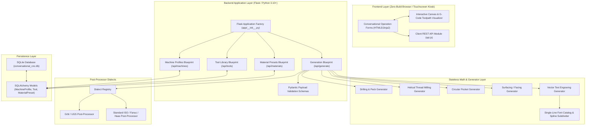

# Conversational CNC Controller: Architecture & Technical Specification

## 1. System Overview & Philosophy

The **Conversational CNC Controller** is a lightweight, web-based, locally executing machining application designed to bridge the gap between complex CAD/CAM software and quick, on-the-fly workshop machining.

### Core Principles
1. **Zero-Build-Step Deployment**: Server-rendered HTML5 templates + vanilla ES6 JavaScript with no Node.js, Webpack, or npm dependencies. Instant offline execution on low-power devices like Raspberry Pi 4/5 touchscreen kiosks or desktop workstations.
2. **Stateless Deterministic Generators**: All G-code calculations are executed by pure Python functions with zero database or web framework dependencies. Given the exact same numerical parameters, generators produce identical, mathematically verified toolpaths.
3. **Controller Dialect Abstraction**: An extensible post-processor registry adapts toolpath commands to target controllers (e.g. expanding canned cycles into linear/rapid moves for Grbl, or emitting native `G81-G83` canned cycles for LinuxCNC/Fanuc/Haas).
4. **Tool Safety & Machine Envelope Guard**: Every toolpath is validated against the active machine's physical travel boundaries with bounding box warnings and physical soft limits checks.

---

## 2. System Architecture & Component Diagram

---

## 3. Conversational Machining Engines

### 3.1. Straight Plunge & Peck Drilling (`app/generators/drilling.py`)
- **Straight Plunge**: Computes linear approach, plunge at feed rate, optional bottom dwell (`G04`), and rapid retract (`G00`) for single holes and multi-hole lists.
- **Peck Drilling**: Supports two industry-standard pecking algorithms:
  - `G83 Deep Hole`: Full retract to safe clearance Z on each peck for chip clearing.
  - `G73 Chip Break`: Small $0.5\text{mm}$ retract lift to break continuous chip ribbons without fully exiting the hole.
- **Grbl Expansion**: Because Grbl does not support canned cycles, the generator calculates and unrolls all intermediate plunges, dwell pauses, and retracts directly into atomic `G0`/`G1` motion blocks.

### 3.2. Helical Thread Milling (`app/generators/thread_milling.py`)
- **Helical Interpolation**: 3D simultaneous circular motion ($X, Y$) with synchronized $Z$ pitch descent ($Z = Z_{\text{start}} - \text{Pitch} \cdot \theta / 2\pi$).
- **Geometry Modes**:
  - **Internal Tapped Holes**: Climb milling from bottom of hole upwards ($Z_{\text{bottom}} \to Z_{\text{top}}$) to eject chips cleanly.
  - **External Threaded Studs**: Climb milling from top of stud downwards ($Z_{\text{top}} \to Z_{\text{bottom}}$).
- **Lead-In & Lead-Out**: 180° semi-circular tangential helical arc transitions to eliminate tool dwell gouging.
- **Radial Multipass Stepping**: Multi-pass roughing passes plus zero-cut spring passes to combat tool deflection.
- **Thread Standards Catalog**: Built-in dimensional database for Metric ISO (M2 to M20 coarse/fine) and Imperial UN (UNC #2-56 to 3/4-10, UNF #10-32 to 1/2-20).

### 3.3. Circular Pocketing & Helical Boring (`app/generators/circular_pocket.py`)
- **Concentric Radial Stepover**: Smooth concentric clearing passes expanding outward from center.
- **Entry Strategies**: Plunge or Helical ramp entry with configurable ramp angle.
- **Perimeter Finish Pass**: Independent wall finishing pass with clean overlap to remove tool marks.

### 3.4. Workpiece & Spoilboard Surfacing (`app/generators/surfacing.py`)
- **Raster Strategies**:
  - `Zig-Zag (Bidirectional)`: Continuous cutting in both $+X$ and $-X$ directions for maximum material removal speed.
  - `Climb One-Way (Unidirectional)`: Cuts in climb direction, rapids back at safe Z clearance for maximum surface finish quality.
- **Overtravel & Overlap**: Configurable cutter overtravel past workpiece edges and stepover percentage ($10\%\text{--}90\%$).
- **Datum Reference Modes**: Center origin $(X_c, Y_c)$ or Bottom-Left corner $(X_0, Y_0)$.

### 3.5. Single-Line Vector Text Engraving (`app/generators/engraving.py` & `engraving_font.py`)
- **Layout Modes**:
  - `Linear Layout`: Supports multi-line text (`\n`), arbitrary rotation angle $\theta$, and alignment (`left`, `center`, `right`).
  - `Arc / Circular Layout`: Polar wrapping along circular pitch radius $R$, center $(X_c, Y_c)$, start/center angle, and wrap direction (clockwise top arc vs. counter-clockwise bottom arc).
- **Font Catalog**: 5 custom single-line stroke fonts:
  1. `simplex_sans`: Clean single-stroke sans-serif.
  2. `duplex_sans`: Bold double-stroke sans-serif with parallel offset toolpaths.
  3. `roman_serif`: Classic Roman formal serif lettering with base feet.
  4. `cursive_script`: Elegant flowing script with cursive flourishes.
  5. `block_stencil`: Industrial 45° chamfered octagonal block lettering.
- **Parametric Curve Interpolation & Smoothing**:
  - Cubic Catmull-Rom spline subdivision with **sharp-corner preservation** (angles $\ge 65^\circ$ remain sharp, while curved loops and circles are subdivided into smooth continuous paths).
  - Configurable sampling multiplier ($1\times$ coarse, $2\times$ medium, $4\times$ smooth, $8\times$ fine, $12\times$ ultra-smooth).
- **Tool Tip Flat Calculation**: Computes live surface cut width based on V-bit angle $\theta$, tip flat width $W_{\text{tip}}$, and cutting depth $d$:
  $$W_{\text{cut}} = W_{\text{tip}} + 2d\tan(\theta/2)$$

### 3.6. Rectangular Pocket & Boss / Island Machining (`app/generators/rectangular_pocket.py`)
- **Rectangular Pocket**: Concentric clearing loops with corner fillets ($R_c$), helical ramp entry, customizable stepover percentage, and a dedicated perimeter wall finishing contour pass with tangential lead-in/out.
- **Boss / Raised Island Machining**: Clears the outer perimeter area between the stock boundary and a precision raised rectangular island feature.

### 3.7. Linear Slotting & Keyways (`app/generators/slotting.py`)
- **Linear Slots**: Cuts straight slots between arbitrary coordinates $(X_1, Y_1)$ and $(X_2, Y_2)$ with depth stepdowns, centerline cutting (when $W_{\text{slot}} = D_{\text{tool}}$) or automated side clearing passes (when $W_{\text{slot}} > D_{\text{tool}}$).

### 3.8. 2D Chamfering & Edge Breaking (`app/generators/chamfering.py`)
- **Edge Deburring & Chamfering**: Calculates exact tip offset and plunge depth ($Z = -(W_{\text{chamfer}}/\tan(\theta/2) + d_{\text{tip}})$) for conical 45°, 60°, 90°, and 120° V-bits / chamfer mills along outer perimeter or pocket edges.

---

## 4. Machine Profiles & Router Spindle Management

### 4.1. Router Speed Dial Mapping
For CNC machines utilizing manual trim routers (such as the DeWalt DWP611), spindle speeds cannot be controlled via PWM/VFD. The system provides:
- **Discrete Dial Mapping**:
  - Dial 1: 16,000 RPM
  - Dial 2: 18,200 RPM
  - Dial 3: 20,400 RPM
  - Dial 4: 22,600 RPM
  - Dial 5: 24,800 RPM
  - Dial 6: 27,000 RPM
- **RPM Clamping & Operator Instructions**: Automatically clamps speeds below 16k RPM and injects explicit human-readable dial setup instructions in G-code program headers.

### 4.2. Tool Library & Material Presets
- **Tools**: Stores tool number, name, type (endmill, ball, V-bit, thread mill, flycutter), diameter, flute count, and flute length.
- **Material Presets**: Stores material-specific parameters (spindle RPM, feed rate XY, plunge feed, max stepdown Z, stepover %) attached to specific tools for woods, plastics, brass, and aluminum.

---

## 5. Visualizer & G-Code Simulation Engine

The client-side visualizer (`app/static/js/visualizer.js`) provides a zero-dependency interactive toolpath canvas:

1. **True CNC Vector Toolpath Simulation**:
   - **Cutting Feeds (`G1`)**: Drawn in solid cyan (`#38bdf8`) with stroke thickness scaled to the cutter / tip flat width.
   - **Rapid Traverses (`G0`)**: Drawn in dashed pink/red (`rgba(244, 63, 94, 0.75)`) connecting retract lifts to plunge entries across safe Z clearance.
   - **Plunge Markers**: Green circles (`#10b981`) marking exact points where the tool enters the material ($Z \le 0$).
   - **Retract Markers**: Amber circles (`#f59e0b`) marking points where the tool lifts to safe Z.
2. **Direct G-Code AST Parser (`loadGCode`)**:
   - Parses generated G-code programs line by line, maintaining modal registers ($X, Y, Z, I, J, R, F, \text{motion mode}$) to backplot machine motion.
3. **Interactive Viewport Controls**:
   - Pan (click & drag), Zoom (mouse-wheel and zoom buttons), Auto-fit bounding box, and machine envelope soft limits overlay.

---

## 6. Development Status & Roadmap

- **Phase 1 (Completed)**: Core architecture, SQLite schema, Straight Plunge drilling, Grbl post-processor, DeWalt DWP611 dial mapping.
- **Phase 2 (Completed)**: Helical Thread Milling, Peck Drilling (G73/G83), Circular Pocketing, Surfacing/Facing, Single-Line Vector Text Engraving with 5 fonts and spline smoothing, 2D vector toolpath visualizer.
- **Phase 3 (Completed)**: Bolt Circle (PCD) & Matrix Grid hole patterns, Rectangular Pockets & Boss/Island milling, Linear Slotting & 2D Chamfering / Edge Deburring.
- **Phase 4 (Upcoming)**: 3D WebGL / Three.js isometric backplotter with animated tool simulation and bi-directional G-code sync.
- **Phase 5 (Upcoming)**: Plain English G-Code Hints and live Modal State inspector.
- **Phase 6 (Upcoming)**: G-Code Transformations (Shift, Rotate, Mirror, R-to-IJK conversion, Multi-tool program file splitter).

