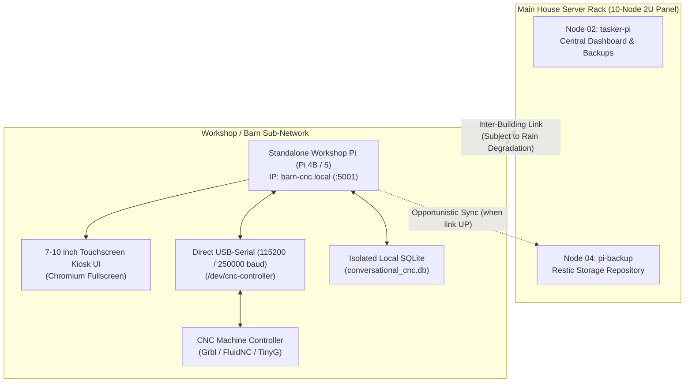

# Host Viability & Physical Topology Analysis: Conversational CNC Controller

## 1. Executive Summary & Hardware Recommendation

Following an empirical code audit and operational environment evaluation, the authoritative deployment target for the **Conversational CNC Controller** is a **Dedicated Standalone Raspberry Pi 4B / Pi 5 Node in the Workshop (Barn)**.

---

## 2. Key Environmental & Operational Constraints

1. **Physical Machine Attachment (USB-Serial Real-Time Motion Control)**:
   - The CNC controller uses USB-serial (`/dev/ttyUSB0` or `/dev/ttyACM0` via CH340, CP2102, or FTDI chipset).
   - Real-time motion streaming requires deterministic sub-millisecond polling ($t_{\text{ack}} < 2\text{ms}$) and continuous circular buffer replenishment. Any buffer underrun during active milling causes cutter deceleration, tool chatter, surface gouging, or broken endmills.
   - Hosting the controller in the main house rack would require Wi-Fi streaming across buildings, which introduces packet jitter, latency spikes, and buffer starvation.

2. **Inter-Building Link Fragility (Rain Degradation)**:
   - The wireless/inter-building bridge between the main house and the barn experiences packet loss and link drops during rain and storms.
   - **Critical Architecture Standard**: The workshop CNC controller must be **100% offline-first**. All G-code calculations, conversational form parameter models, tool/material databases, and serial motion streaming must execute entirely on local hardware without depending on the house network or cloud internet during cutting operations.

3. **Compute & Thermal Viability on Pi 4 / Pi 5**:
   - **RAM Footprint**: ~45–65 MB RSS.
   - **CPU Utilization**: Idle $\approx 0\%$; G-code generation burst $\approx 5\text{--}15\%$ for $100\text{ms}$.
   - **Storage**: Lightweight SQLite file (`< 10MB`).
   - A standard Raspberry Pi 4B (2GB/4GB) or Pi 5 in an aluminum passive-cooling case provides more than $10\times$ the headroom needed for the application and Chromium touchscreen kiosk.

---

## 3. Host Topology Evaluation Matrix

| Criterion | Main House Rack (Node 02/04) | Dedicated x86_64 Mini PC | Standalone Workshop Pi 4/5 (Selected) |
| :--- | :--- | :--- | :--- |
| **USB Serial Direct Link** | ❌ Impossible (different building) | ✅ Yes | ✅ Yes (Direct high-speed USB) |
| **Offline Rain Resilience** | ❌ Link drop halts machine | ✅ 100% Offline | ✅ 100% Offline |
| **Touchscreen Kiosk Support**| ❌ Remote browser only | ✅ Yes (Overkill) | ✅ Native 7-10" DSI/HDMI Kiosk |
| **Power Consumption** | N/A (Existing rack) | ❌ 25–45W continuous | ✅ 3–7W (Low workshop idle draw) |
| **System Complexity** | High (Network forwarding) | High (Separate OS/GPU) | ✅ Clean, turnkey standard |
| **Disaster Recovery** | Shared backup | Independent backup | ✅ Turnkey `bootstrap_node.sh` |

---

## 4. Conclusion & Action Plan
Proceed with the formulation of **Plan M12 / Plan 01** to configure the standalone workshop node provisioning scripts, udev device rules, local kiosk autostart, and opportunistic backup synchronization to Node 04.
