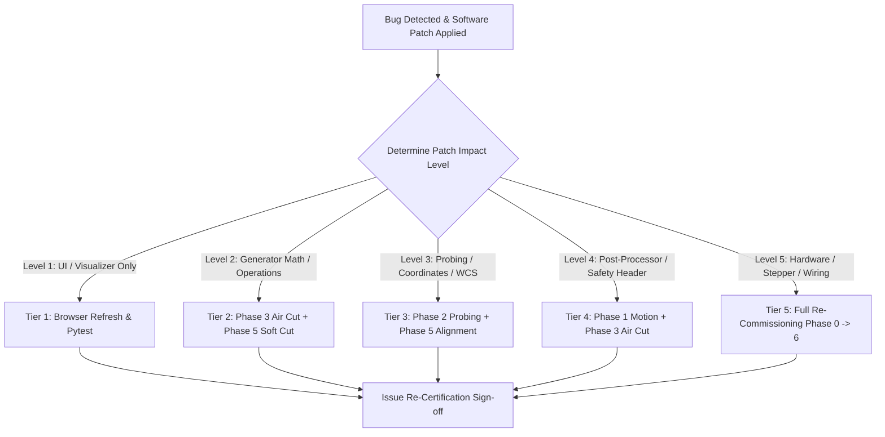

# 🧪 Machine Integration & Physical Commissioning Test Plan

A systematic, progressive-risk commissioning framework for bringing up a new or modified CNC machine (Grbl, Smoothieboard, FluidNC, LinuxCNC) with the **Conversational CNC Controller**.

---

## 🎯 Objectives & Philosophy

1. **Progressive Risk Escalation (Envelope Expansion)**:
   $$\text{Static Electrical/Safety} \longrightarrow \text{Dry Air (Spindle OFF)} \longrightarrow \text{Air Run (Spindle ON / EMI Check)} \longrightarrow \text{Soft Foam/MDF Test} \longrightarrow \text{Target Material}$$
2. **Time-Efficient Validation**: Targeted verification steps designed to achieve 100% operational confidence in under 90 minutes.
3. **Deterministic Reversion & Regression Protocol**: A formal impact-matrix detailing exactly which test tiers must be re-run when software or firmware patches are applied.

---

## 📋 Commissioning Matrix Overview

| Phase | Description | Machine State | Risk Level | Target Time |
|---|---|---|---|---|
| **Phase 0** | Static Safety & Electrical Lockout | Motors OFF / Spindle UNPLUGGED | Zero Risk | 10 min |
| **Phase 1** | Axis Polarities, Motion Scale & Homing | Motors ON / Spindle UNPLUGGED | Very Low | 15 min |
| **Phase 2** | Probing, Tool Setting & WCS (`G54`) | Motors ON / Spindle UNPLUGGED | Low | 15 min |
| **Phase 3** | Full Conversational Air Verification | Motors ON / Spindle UNPLUGGED | Low | 20 min |
| **Phase 4** | Spindle Control & EMI Immunity | Motors ON / Spindle ON (No Cut) | Medium | 10 min |
| **Phase 5** | Soft Medium First Cuts (Foam/MDF) | Cutting Test Workpiece | Medium | 15 min |
| **Phase 6** | Production Hard Material Validation | Full Load Machining | Standard | 10 min |

---

## 🛡️ Phase 0: Static Safety & Electrical Lockout

> **Safety Rule:** Disconnect physical mains power from the spindle/router. Wear eye protection.

### Steps:
- [ ] **0.1 Physical E-Stop Trip Test**: Press the Emergency Stop button. Verify all motor power drops instantly and the controller enters alarm mode (`[MSG:Reset to continue]` or alarm code).
- [ ] **0.2 Controller Communication**: Connect via USB / Web. Send `?` or `$G`. Verify instant bidirectional telemetry and response.
- [ ] **0.3 Multimeter Continuity on Touch Plate**:
  - Connect probe clip to collet and touch plate to multimeter (continuity mode).
  - Tap plate to endmill: Multimeter must beep cleanly without intermittent resistance.
- [ ] **0.4 Mechanical Clearances**: Hand-jog carriage (steppers disabled) across the full travel envelope ($X_{\max}, Y_{\max}, Z_{\max}$). Verify cable chains, vacuum hoses, and wiring do not bind or snag.

---

## 🧭 Phase 1: Axis Polarities, Motion Scale & Homing

### Steps:
- [ ] **1.1 Axis Motion Directions (Right-Hand Rule)**:
  - Command `G91 G0 X+10 F500`: Spindle carriage MUST move **Right**.
  - Command `G91 G0 Y+10 F500`: Gantry MUST move **Back / Away from operator**.
  - Command `G91 G0 Z+10 F300`: Z-axis MUST move **Up (away from bed)**.
  - *If any axis moves inverted: Invert direction pins in controller (`$3` in Grbl, `direction_pin` in Smoothieware).*
- [ ] **1.2 Limit Switch State Verification**:
  - Manually trigger $X, Y, Z$ limit switches by hand while observing status (`?` in Grbl).
  - Verify switches report `Pn:XYZ` when depressed and clear when released.
- [ ] **1.3 Homing Cycle (`$H` / `G28`)**:
  - Jog tool to center table at safe height.
  - Run **🎯 Probe & Zero $\rightarrow$ Homing Sequence (`$H`)**.
  - Verify Z lifts first to hit $Z_{\max}$ switch, retracts, then $X$ and $Y$ seek limits simultaneously.
  - Verify pull-off distance ($1\text{mm}$–$3\text{mm}$) leaves switches untriggered.
- [ ] **1.4 Distance Calibration (100mm Test)**:
  - Mount dial indicator or position precision ruler along X-axis.
  - Command `G91 G0 X100 F1000`.
  - Measure actual travel: Must equal $100.00\text{mm} \pm 0.1\text{mm}$.
  - Repeat for Y-axis and Z-axis ($50.00\text{mm}$ on Z).
- [ ] **1.5 Manual Jog Controller & Live DRO Verification**:
  - Open **"🕹️ Jog & DRO"** pendant (or press `J`).
  - Set step distance to `10.0mm`. Click `+X`, `-X`, `+Y`, `-Y`, `+Z`, `-Z`.
  - Verify live DRO coordinates update cleanly in real-time.
  - Test keyboard navigation: Press `ArrowUp`, `ArrowDown`, `PageUp`, `PageDown`, and `Shift` for rapid speed.
  - Test quick zero buttons (`Zero X`, `Zero Y`, `Zero Z`, `Zero XYZ`) and verify `G10 L20 P1` executes.
  - Test `Go To Origin`: Verify machine safely lifts Z before moving XY to part origin.

---


## 🎯 Phase 2: Probing, Tool Setting & Work Coordinate Systems (`G54`)

### Steps:
- [ ] **2.1 Dry Touch Plate Trigger (Air Test)**:
  - Attach alligator clip to tool collet. Hold touch plate in hand $10\text{mm}$ below tool bit.
  - Run **🎯 Probe & Zero $\rightarrow$ Z-Touch Plate Macro**.
  - While tool is feeding downward at $150\text{mm/min}$, tap plate against tool bit in mid-air.
  - Verify tool halts instantly, lifts $1.5\text{mm}$, executes slow $25\text{mm/min}$ fine touch, sets `G10 L20 P1 Z<thickness>`, and lifts to safe clearance ($20\text{mm}$).
- [ ] **2.2 Workpiece Z-Zero Calibration**:
  - Place touch plate on top of scrap MDF stock.
  - Run **Z-Touch Plate Macro**.
  - Upon completion, command `G90 G0 Z0.000` (slowly at $F100$).
  - Perform paper/feeler gauge test: A sheet of paper ($0.1\text{mm}$) should slide with slight friction between the tool tip and stock surface.
- [ ] **2.3 Corner XYZ Block Calibration**:
  - Position touch block on bottom-left corner of stock.
  - Run **Corner XYZ Macro**.
  - Verify 3-axis probing sequence (Z top $\rightarrow$ X outside edge with cutter radius compensation $\rightarrow$ Y outside edge).
  - Command `G90 G0 X0.000 Y0.000 Z5.000`. Verify tool tip centers directly over the physical stock corner.
- [ ] **2.4 Coordinate Persistence Across Soft Reset**:
  - Issue soft reset (`Ctrl-X` / `$X`). Re-query coordinate system (`$#` or `$G`).
  - Verify `G54` non-volatile memory retained calibrated offsets.

---

## ⚡ Phase 3: Conversational CNC Motion Verification (Air Cuts, Spindle OFF)

Generate test programs from Conversational CNC UI with workpiece origin set to $Z=0$ ($20\text{mm}$ above bed):

### Test 3.1: Straight Plunge & Deep Peck Drilling
- **Parameters**: 4-hole grid, $5.0\text{mm}$ retract, $1.0\text{mm}$ clearance, $10.0\text{mm}$ depth, $2.0\text{s}$ bottom dwell.
- **Verification**:
  - Visualizer and tool match exact hole coordinates.
  - Peck cycle lifts to retract plane (full retract) or chip break lift without axis binding.
  - Spindle dwells at hole bottom for exactly $2.0\text{s}$.

### Test 3.2: Helical Thread Milling & Circular Pocketing
- **Parameters**: Internal M10 thread and 30mm bearing pocket with helical ramp entry.
- **Verification**:
  - Smooth $G2/G3$ helical interpolation with continuous Z descent.
  - No stuttering, jerky motor steps, or buffer underrun pauses during continuous arc moves.
  - Tangential 180° semi-circular lead-in and lead-out arcs execute cleanly.

### Test 3.3: Workpiece Surfacing (Facing)
- **Parameters**: $100\text{mm} \times 100\text{mm}$, Zig-Zag raster, $10.0\text{mm}$ stepover, $10.0\text{mm}$ cutter overtravel.
- **Verification**:
  - Toolpath passes over stock boundaries by exactly the overtravel distance without exceeding table limits.
  - Reversal arc / stepover rapid moves clear stock edges cleanly.

### Test 3.4: Single-Line Vector Text Engraving
- **Parameters**: Multi-line text `"CNC 2026"` with Catmull-Rom spline smoothing ($4\times$).
- **Verification**:
  - Tool lifts rapidly to safe Z between distinct character strokes.
  - Spline curve moves stream with smooth motion velocity profile.

---

## 🌪️ Phase 4: Spindle Integration & EMI Noise Baseline

> **Objective**: Verify that high-frequency electromagnetic interference (EMI) from the router/spindle motor brushes or VFD inverter does not corrupt USB serial communication or trigger false limit switch interrupts.

### Steps:
- [ ] **4.1 Spindle Start/Stop Verification**:
  - Reconnect spindle power.
  - Issue `M3 S16000` (or turn on router dial). Verify spindle spins clockwise smoothly.
  - Issue `M5`. Verify spindle comes to a full stop.
- [ ] **4.2 EMI Loaded Dry Run**:
  - Mount cutter bit. Keep $Z$ origin elevated $30\text{mm}$ in the air above stock.
  - Turn on spindle and dust collection vacuum.
  - Run a 10-minute surfacing or pocketing toolpath.
  - **Pass Criteria**: Zero USB disconnects, zero false limit switch interrupts (`Hard limit triggered`), zero lost steps.

---

## 🪵 Phase 5: Soft Medium First Cuts (Dimensional & Side-of-Line Accuracy Certification)

Mount a piece of high-density foam, machinable wax, or scrap MDF.

```
+-------------------------------------------------------------------------+
|                  "PLUG & BORE" SIDE-OF-LINE GAUGE TEST                  |
|                                                                         |
|     (A) 40.0mm Outer Boss           (B) 40.0mm Inner Pocket             |
|         [Outside Offset]                [Inside Offset]                 |
|      Toolpath: D_nom + Tool_D        Toolpath: D_nom - Tool_D           |
|          +-------------+                 +-------------+                |
|          |    ( @ )    |                 |   (     )   |                |
|          | 40.0mm Plug |                 | 40.0mm Bore |                |
|          +-------------+                 +-------------+                |
|                                                                         |
|     (C) 50.0mm Square Check         (D) 12.0mm Wide Linear Slot         |
|         +---------------+                +---------------+              |
|         | 50.0mm Square |                | |===========| | (12.00mm)    |
|         +---------------+                +---------------+              |
+-------------------------------------------------------------------------+
```

### Critical Side-of-Line / Kerf Offset Math & Failure Modes:
| Operation Type | Correct Tool Offset Mode | Correct Cutter Path | If Wrong Side / Centerline Error |
|---|---|---|---|
| **Pocket / Bore (Inside)** | **Inward by $R_{\text{tool}}$** ($D/2$) | Tool stays inside cavity boundary | Cavity will be oversized by $2R$ ($+6.35\text{mm}$) or $+R$ ($+3.175\text{mm}$) |
| **Boss / Island (Outside)** | **Outward by $R_{\text{tool}}$** ($D/2$) | Tool stays outside feature boundary | Boss will be undersized by $2R$ ($-6.35\text{mm}$) or $-R$ ($-3.175\text{mm}$) |
| **Linear Wide Slot** | **Bilateral Symmetrical Offset** | Tool cuts center then cleans walls | Slot width will deviate from nominal $W_{\text{slot}}$ |
| **2D Chamfering** | **Conical Tip Offset $+ Z_{\text{depth}}$** | Chamfer edge lines up at surface | Chamfer bit will gouge wall or cut in air |
| **Text Engraving** | **Zero Offset (Centerline)** | Tool cuts exactly along font stroke | N/A (True single-stroke centerline) |

---

### Steps & Measurements:

- [ ] **5.1 The "Plug & Bore" Mating Test (Side-of-Line Accuracy)**:
  - Tool: $6.35\text{mm}$ (1/4") Endmill.
  - Cut Feature A: $40.00\text{mm}$ Circular Boss (Outside clearing mode).
  - Cut Feature B: $40.00\text{mm}$ Circular Pocket (Inside pocket mode).
  - **Caliper Check**:
    - Outside Boss OD: Must measure $40.00\text{mm} \pm 0.05\text{mm}$. *(If $33.65\text{mm}$, tool cut on wrong side; if $46.35\text{mm}$, offset direction inverted).*
    - Inside Pocket ID: Must measure $40.00\text{mm} \pm 0.05\text{mm}$. *(If $46.35\text{mm}$, tool cut on wrong side).*
  - **Mating Fit**: Insert Plug A into Bore B. The plug must slide with a smooth sliding fit ($\le 0.08\text{mm}$ clearance).
- [ ] **5.2 50mm Square Boss (Gantry Orthogonality & Climb Milling Check)**:
  - Cut $50.0\text{mm} \times 50.0\text{mm}$ outer square in **Climb Milling** mode (Clockwise travel).
  - Side $X$: Must equal $50.00\text{mm} \pm 0.05\text{mm}$.
  - Side $Y$: Must equal $50.00\text{mm} \pm 0.05\text{mm}$.
  - Diagonals $D_1, D_2$: Must equal $70.71\text{mm}$ with $|D_1 - D_2| \le 0.05\text{mm}$ (Confirms gantry is perfectly perpendicular / 90° square).
  - Verify wall finish: Climb milling produces smooth walls without tool chattering.
- [ ] **5.3 Linear Slotting (Centerline vs Wide Wall Finish Pass)**:
  - Cut Slot 1: Single-pass centerline slot at tool diameter ($6.35\text{mm}$).
  - Cut Slot 2: Wide slot specified at $12.00\text{mm}$ width with $0.5\text{mm}$ finish passes.
  - Measure Slot 1 width: Must equal $6.35\text{mm} \pm 0.05\text{mm}$ (Bit runout check).
  - Measure Slot 2 width: Must equal $12.00\text{mm} \pm 0.05\text{mm}$ (Bilateral offset check).
- [ ] **5.4 2-Hole Center-to-Center Pitch**:
  - Drill 2 holes spaced 80.0mm apart along X.
  - Measure center distance: Must equal $80.00\text{mm} \pm 0.05\text{mm}$.
- [ ] **5.5 Surface Flatness (Spindle Tram Check)**:
  - Surface a $60\text{mm} \times 60\text{mm}$ patch with $12\text{mm}$ stepover.
  - Run fingernail across raster ridges: Surface must feel smooth with no ridging steps ($< 0.02\text{mm}$ scallop indicating zero spindle tilt/nod).


---

## 🔄 Test Reversion & Regression Protocol

When a test fails and a software patch, post-processor fix, or firmware update is applied, follow this **Impact-Radius Reversion Matrix** to determine which test tiers must be invalidated and re-executed.



### Impact-Radius Reversion Matrix

| Patch Category | Code Components Affected | Invalidation Scope | Mandatory Re-Execution Steps |
|---|---|---|---|
| **Level 1: UI / Display Only** | `visualizer.js`, `gcode_inspector.js`, CSS, templates | Zero machine risk | 1. Run automated test suite (`pytest`)<br>2. Hard-refresh browser (`Ctrl-F5`). |
| **Level 2: Specific Operation Math** | `app/generators/<op>.py` (e.g. `thread_milling.py`, `engraving.py`) | Affected operation only | 1. Run `pytest`<br>2. Run **Phase 3 Air Cut** for that specific operation<br>3. Run **Phase 5 Soft Cut** for that specific operation. |
| **Level 3: Probing & Coordinate Systems** | `probing.py`, `probing.js`, `G10 L20`, `G38.2` | Work coordinate offsets & Z-zero | 1. Run `pytest`<br>2. Re-run **Phase 2 (All probing steps 2.1–2.4)**<br>3. Re-verify touch plate thickness & gauge clearance. |
| **Level 4: Post-Processor & Safety Headers** | `postprocessors/grbl.py`, `registry.py`, headers/footers | All machine operations | 1. Run `pytest`<br>2. Re-run **Phase 3 (Air verification 3.1–3.4)** across drilling, milling, surfacing. |
| **Level 5: Physical Hardware / Microstepping / Firmware** | Stepper drivers, belts, lead screws, `config.txt`, Grbl `$$` | Full machine calibration | 1. **Complete Re-Commissioning**: Execute **Phase 0 through Phase 6** in sequence. |

---

## 📝 Commissioning Sign-Off Record

```
Machine Name: ___________________________________
Controller Model: [  ] Grbl v1.1   [  ] Smoothieboard v1   [  ] Other: ___________
Operator / Lead: ________________________________
Date Commissioned: ______________________________

Phase 0: Safety & Lockout Checked:       [  ] PASS  Initials: _____
Phase 1: Motion Scale & Homing:          [  ] PASS  Initials: _____
Phase 2: Probing & WCS Calibration:      [  ] PASS  Initials: _____
Phase 3: Conversational Air Cuts:        [  ] PASS  Initials: _____
Phase 4: Spindle & EMI Noise Immunity:   [  ] PASS  Initials: _____
Phase 5: Dimensional Cut Certification:  [  ] PASS  Initials: _____
Phase 6: Production Material Validated:  [  ] PASS  Initials: _____

Final Controller/Machine Certification:  [  ] 100% FLIGHT READY
```
