# 📖 Conversational CNC — Comprehensive Operator Manual & Machining Guide
*The complete reference manual for parametric 2.5D CAM programming, feeds & speeds physics, vector CAD importing, and machine control.*

---

> [!CAUTION]
> ### ⚠️ EXPERIMENTAL & UNTESTED SOFTWARE DISCLAIMER
> **Conversational CNC is an active open-source project and is AS OF YET UNTESTED ON PHYSICAL CNC MACHINERY.**
>
> CNC milling machines and routers are powerful, high-energy tools capable of severe physical injury, tool breakage, workpiece damage, electrical fire, or machine destruction if commanded incorrectly. While this software contains an extensive automated mathematical and API test suite (154 passing unit tests), **no guarantee is made that generated G-code is bug-free, safe for your particular machine setup, or free of unexpected motion commands.**
>
> **MANDATORY SAFE STARTUP & INITIAL COMMISSIONING PROTOCOL:**
> If you choose to use this software on a physical CNC machine, you MUST follow the progressive-risk startup procedures detailed in [MACHINE_INTEGRATION_TEST_PLAN.md](MACHINE_INTEGRATION_TEST_PLAN.md):
> 1. **Phase 0–3 Air Cuts (Spindle UNPLUGGED)**: Always physically disconnect AC power from your router or spindle. Set your work datum ($Z0$) high above the spoilboard in mid-air and execute full dry runs while observing travel directions, clearance planes, and rapid paths.
> 2. **Verify Axis Motion Polarities**: Confirm right-hand rule directions ($+X$ Right, $+Y$ Away from operator, $+Z$ Up away from bed).
> 3. **Verify Limit Switches & Soft Limits**: Ensure emergency stops, physical limit switches, and software travel limits (`$20=1` in Grbl) are active and tested.
> 4. **Keep Hand on Physical E-Stop**: Never leave the machine unattended during operation. Maintain immediate physical access to your hardware Emergency Stop button.
> 5. **Phase 5 Soft Material Testing**: First live cuts must always be performed in scrap rigid insulation foam or lightweight scrap MDF before attempting hardwoods, acrylic, or metals.
> 6. **Pre-Flight Visual Inspection**: Always verify generated toolpaths using the built-in 3D WebGL orbital backplotter and read the plain-English G-code explanation before sending code to machine hardware.

---

## Table of Contents
1. [Safety Disclaimer & Initial Startup Testing](#table-of-contents)
2. [Interface Overview & Layout Architecture](#1-interface-overview--layout-architecture)
2. [Machine Coordinates, Probing & Zeroing (WCS G54–G59)](#2-machine-coordinates-probing--zeroing-wcs-g54g59)
   - [2.1 The Coordinate Hierarchy (MPOS vs WPOS)](#21-the-coordinate-hierarchy-mpos-vs-wpos)
   - [2.2 Z-Surface Touchplate Probing](#22-z-surface-touchplate-probing)
   - [2.3 Corner XYZ Edge Finding & Lip Offsets](#23-corner-xyz-edge-finding--lip-offsets)
   - [2.4 Manual Jog Controller & Live DRO](#24-manual-jog-controller--live-dro)
3. [Feeds, Speeds & Machine Rigidity Guide](#3-feeds-speeds--machine-rigidity-guide)
   - [3.1 Belt-Driven CNC Physics & Machine Flex](#31-belt-driven-cnc-physics--machine-flex)
   - [3.2 Router Speed Dials (DeWalt DWP611 & Makita RT0701)](#32-router-speed-dials-dewalt-dwp611--makita-rt0701)
   - [3.3 Comprehensive Feeds, Speeds & Stepdown Table](#33-comprehensive-feeds-speeds--stepdown-table)
   - [3.4 Radial Chip Thinning Factor (RCTF) Explained](#34-radial-chip-thinning-factor-rctf-explained)
4. [Milling Operations — Detailed Field & Setting Reference](#4-milling-operations--detailed-field--setting-reference)
   - [4.1 Workpiece & Spoilboard Surfacing](#41-workpiece--spoilboard-surfacing)
   - [4.2 Rectangular & Circular Pocketing / Island Bosses](#42-rectangular--circular-pocketing--island-bosses)
   - [4.3 2.5D Contouring, Holding Tabs & Lead-Ins](#43-25d-contouring-holding-tabs--lead-ins)
   - [4.4 Straight Plunge & Deep Hole Peck Drilling](#44-straight-plunge--deep-hole-peck-drilling)
   - [4.5 Linear Slotting & Corner Chamfering](#45-linear-slotting--corner-chamfering)
   - [4.6 Single-Point Helical Thread Milling](#46-single-point-helical-thread-milling)
5. [Vector CAD Importers (SVG & DXF)](#5-vector-cad-importers-svg--dxf)
   - [5.1 SVG Importer with Grayscale Luminance-to-Depth Mapping](#51-svg-importer-with-grayscale-luminance-to-depth-mapping)
   - [5.2 DXF 2D CAD Vector Importer & Automatic Closed Loops](#52-dxf-2d-cad-vector-importer--automatic-closed-loops)
6. [Single-Line Hershey Typography & Text Engraving](#6-single-line-hershey-typography--text-engraving)
7. [Nesting & Vise Soft Jaw Fixturing](#7-nesting--vise-soft-jaw-fixturing)
8. [Multi-Operation Job Builder & Tool Change Sequencer](#8-multi-operation-job-builder--tool-change-sequencer)
9. [3D WebGL Toolpath Inspector & Simulation Scrubber](#9-3d-webgl-toolpath-inspector--simulation-scrubber)
10. [End-to-End Machining Tutorials](#10-end-to-end-machining-tutorials)
    - [Tutorial 1: Spoilboard Flattening & Raw Stock Resurfacing](#tutorial-1-spoilboard-flattening--raw-stock-resurfacing)
    - [Tutorial 2: Precision Bracket Cutout with Holding Tabs](#tutorial-2-precision-bracket-cutout-with-holding-tabs)
    - [Tutorial 3: Multi-Depth Badge Carving from SVG Graphic](#tutorial-3-multi-depth-badge-carving-from-svg-graphic)

---

## 1. Interface Overview & Layout Architecture

Conversational CNC is structured around a consistent, predictable **Two-Column Shop-Floor Layout**:

```
+---------------------------------------------------------------------------------------------------+
|  [CNC LOGO]  [OP NAV TABS: Plunge | Peck | Thread | Circle | Rect | Surface | Engrave | ...]       |
|  [📋 Job Builder (3)]  [🕹️ Jog & DRO]  [🎯 Probe & Zero]  [● X-Carve 1000mm (GRBL)]               |
+---------------------------------------------------+-----------------------------------------------+
|  LEFT COLUMN: Parameters & Tooling Cards          |  RIGHT COLUMN: 3D Visualizer & Inspector      |
|                                                   |                                               |
|  1. Geometry & Placement                          |  [ 3D View | ISO | Top | Front | Fit ]        |
|     - Dimensions, offsets, coordinates            |  +-----------------------------------------+  |
|                                                   |  |                                         |  |
|  2. Depths & Clearances                           |  |   WebGL 3D Interactive Toolpath         |  |
|     - Top Z, Target Depth, Stepdown per pass      |  |   Cyan = Cut Moves | Red = Rapids       |  |
|                                                   |  |                                         |  |
|  3. Strategy & Entry Options                      |  +-----------------------------------------+  |
|     - Helical ramp, climb/conventional, tabs      |  [⏮] [ ▶ Play ] [⏭] [=== Scrub Timeline ===]  |
|                                                   |  [WCS: G54 | Plane: G17 | Units: G21 | ...]   |
|  4. Tooling, Speeds & Router Dials                |  +-----------------------------------------+  |
|     - Bit selection, material physics, feeds      |  | Quick Metrics: Cavity Size, Passes, Time|  |
|                                                   |  +-----------------------------------------+  |
|  [ ⚡ Generate G-Code & Preview ]  [ ➕ Queue Op ] |  | Interactive G-Code Editor [Copy] [Download]| |
+---------------------------------------------------+-----------------------------------------------+
```

### Top Navigation Bar & Global Action Modals
- **Operation Tabs**: Instantly switch between drilling, milling, engraving, CAD importers, nesting, and machine utilities. All inputs are saved in browser memory so you never lose your settings when switching tabs.
- **`📋 Job Builder`**: Opens the slide-out drawer containing your queued sequence of operations for multi-tool project export.
- **`🕹️ Jog & DRO`**: Opens the manual jog controller and live digital readout with hotkey support.
- **`🎯 Probe & Zero`**: Opens the 2-stage precision touchplate and XYZ corner edge-finding probing wizard.
- **Active Machine Profile Badge**: Displays the currently active machine configuration (e.g. *Inventables X-Carve 1000mm*) and target G-code dialect (*GRBL, LinuxCNC, RepRap, Haas*).

---

## 2. Machine Coordinates, Probing & Zeroing (WCS G54–G59)

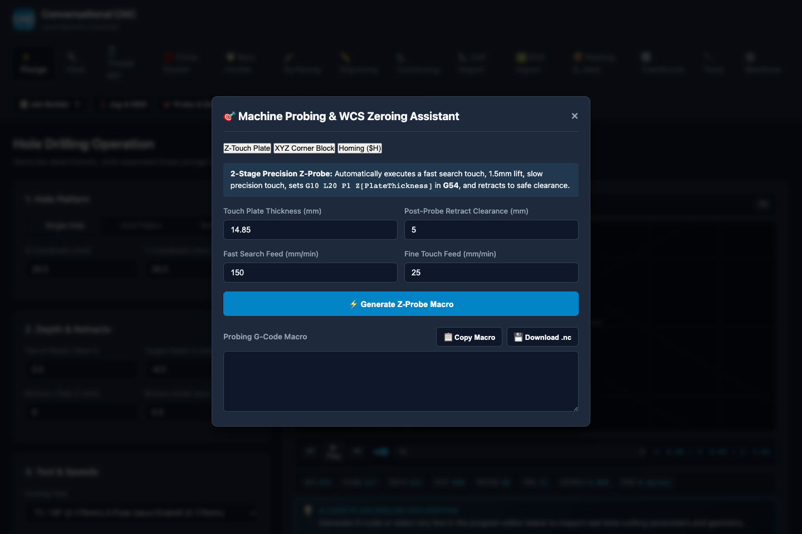

### 2.1 The Coordinate Hierarchy (MPOS vs WPOS)
Understanding CNC coordinates prevents 99% of crashes:
1. **Machine Position (MPOS)**: The absolute hardware position of the cutter relative to physical limit switches established after Machine Homing (`$H`). MPOS values are fixed physical measurements.
2. **Work Position (WPOS / WCS)**: The offset position relative to your specific workpiece datum. When you program a pocket at `X=0, Y=0, Z=0`, the CNC executes moves relative to the active Work Coordinate System (**G54** is default; **G55–G59** are secondary fixtures).

---

### 2.2 Z-Surface Touchplate Probing

Setting `Z=0` at the exact top surface of your workpiece is essential for accurate depth of cut.

#### Parameter Reference & Purpose:

| Setting Name | Default | What It Is & Why It Matters |
| :--- | :---: | :--- |
| **Touch Plate Thickness** | `14.85 mm` | **The exact measured physical thickness of your aluminum/brass touchplate.**<br>• *Why it matters*: When the bit contacts the plate, the machine is physically at $+14.85\text{mm}$ above the stock. Conversational CNC issues `G10 L20 P1 Z14.85`, perfectly placing $Z=0$ at the true wood/metal surface. |
| **Fast Search Feed** | `150 mm/min` | **The downward speed during the initial probe search.**<br>• *Why it matters*: Fast enough to avoid waiting, but slow enough that electrical contact triggers before mechanical deflection occurs. |
| **Fine Touch Feed** | `25 mm/min` | **The slow secondary probing speed.**<br>• *Why it matters*: After the initial touch, the machine backs off $1.5\text{mm}$ and touches down again at this ultra-slow feed rate to eliminate switch debounce and timing latency, delivering $\pm 0.01\text{mm}$ repeatability. |
| **Post-Probe Retract** | `5.0 mm` | **How high the cutter retracts after zeroing is complete.**<br>• *Why it matters*: Lifts the tool safely above the touchplate so you can remove the plate and grounding clip without snagging the cutter tip. |

---

### 2.3 Corner XYZ Edge Finding & Lip Offsets

The Corner Probing Wizard finds the exact $X0, Y0, Z0$ front-left corner of a rectangular block in a single automated routine.

#### Parameter Reference & Purpose:

| Setting Name | Default | What It Is & Why It Matters |
| :--- | :---: | :--- |
| **Plate Z Thickness** | `14.85 mm` | The thickness of the touchplate body resting on top of the workpiece. |
| **Corner X / Y Lip Width** | `10.0 mm` | **The overhang thickness of the alignment ledge.**<br>• *Why it matters*: The touchplate hugs the front-left corner of the stock. When the tool touches the plate's outside X wall, the actual workpiece edge is offset inward by this exact lip width plus half the tool diameter ($R_{tool} + \text{Lip}$). |
| **Tool Diameter** | `3.175 mm (1/8")` | **The cutting diameter of the loaded endmill.**<br>• *Why it matters*: Essential for cutter radius compensation ($R = D/2$) during X and Y edge probing. |
| **Probe Feed** | `100 mm/min` | Downward and lateral search feed rate. |
| **Target Coordinate System** | `G54` | The fixture register (**G54** through **G59**) where the calculated zero offsets are stored. |

---

### 2.4 Manual Jog Controller & Live DRO

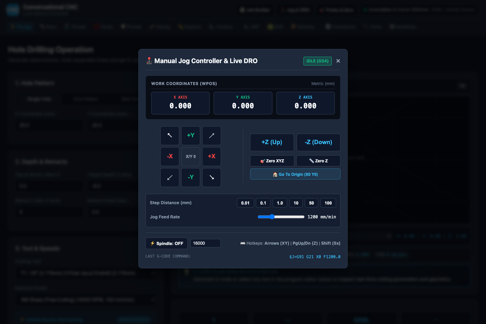

Open the Jog Controller anytime using the header button or keyboard shortcut **`J`**.

#### Controls & Shortcuts:
- **D-Pad Direction Buttons**: Jog $+X, -X, +Y, -Y$ and diagonal moves.
  - *Keyboard*: **Arrow Keys** (Left/Right = X, Up/Down = Y).
- **Z-Axis Lift & Plunge**: $+Z\text{ (Up)}, -Z\text{ (Down)}$.
  - *Keyboard*: **Page Up** / **Page Down** (or **[** / **]**).
- **Step Increment Selector**: `0.01mm`, `0.1mm`, `1.0mm`, `10mm`, `50mm`, `100mm`.
  - *Tip*: Hold **Shift** while pressing arrow keys to jog at **5x** step size for fast manual positioning.
- **`Zero XYZ` / `Zero Z` Buttons**: Instantly resets the active work coordinate system to the current position (`G10 L20 P1 X0 Y0 Z0`).
- **`Go To Origin (X0 Y0)`**: Safely retracts Z to safe height and rapids X and Y to $(0,0)$.
- **Spindle Toggle & Speed Test**: Turn spindle on/off at a programmed RPM to verify rotation and VFD/relay communications.

---

## 3. Feeds, Speeds & Machine Rigidity Guide

### 3.1 Belt-Driven CNC Physics & Machine Flex

Desktop CNC routers (like the **Inventables X-Carve 1000x1000** and **Shapeoko**) use GT2 belts and V-wheels running on aluminum extrusions. While versatile, their 1000mm span introduces mechanical compliance (flex) under lateral cutting loads:

1. **Gantry Flex**: Heavy lateral cutting forces bend the gantry slightly backward, causing dimensional inaccuracies, tool deflection, and severe chatter.
2. **Belt Elasticity**: Over-aggressive feed rates stretch the belts elastically, causing skipped steps and rough, ribbed surface finishes.
3. **Z-Axis Lead Screw / Threaded Rod Limits**: Plunging faster than $250\text{ mm/min}$ into solid material can stall the Z stepper motor, causing loss of Z-height and ruining the workpiece.

> [!IMPORTANT]
> **The Golden Rule for Belt-Driven CNCs**: Take **moderate feed rates** with **shallow depth per pass (stepdown)**. For example, milling a 6mm deep pocket in hardwood should be done in 7 to 8 shallow passes of $0.8\text{mm}$ rather than 2 aggressive passes of $3.0\text{mm}$.

---

### 3.2 Router Speed Dials (DeWalt DWP611 & Makita RT0701)

Trim routers do not have closed-loop electronic RPM controllers. Use this calibrated lookup table to set the physical dial on top of your router motor:

| Dial Position | DeWalt DWP611 RPM | Makita RT0701 RPM | Recommended Tooling & Material Use Cases |
| :---: | :---: | :---: | :--- |
| **Dial 1** | **~16,000 RPM** | **~10,000 RPM** | **Surfacing bits (1"+), Acrylic & Plastics, 6061 Aluminum, 360 Brass.** *(Keeps heat low to prevent melting plastics or dulling carbide in metals).* |
| **Dial 2** | **~18,200 RPM** | **~14,000 RPM** | **Hardwoods (Oak, Hard Maple, Walnut, Cherry), 1/4" Endmills.** |
| **Dial 3** | **~20,400 RPM** | **~18,000 RPM** | **Softwoods (Pine, Cedar, Fir), MDF, Baltic Birch Plywood.** |
| **Dial 4** | **~22,600 RPM** | **~22,000 RPM** | **General purpose 1/8" 2-flute endmills in wood.** |
| **Dial 5** | **~24,800 RPM** | **~26,000 RPM** | **Micro endmills (1/16", 1/32") and high-speed PCB isolation routing.** |
| **Dial 6** | **~27,000 RPM** | **~30,000 RPM** | **V-Bit engraving and diamond drag engraving.** |

---

### 3.3 Comprehensive Feeds, Speeds & Stepdown Table

These conservative parameters are calibrated to produce smooth, chatter-free cuts and extend tool life:

| Material | Tool Description | Spindle RPM (Dial) | Feed Rate XY | Plunge Rate Z | Stepdown / Pass | Stepover % |
| :--- | :--- | :---: | :---: | :---: | :---: | :---: |
| **Softwood (Pine, Cedar)** | 1/8" Upcut (3.175mm) | 16,000 (Dial 1) | 950 mm/min (37 ipm) | 230 mm/min (9 ipm) | 1.0 mm (0.040") | 40% (1.27mm) |
| **Softwood (Pine, Cedar)** | 1/4" Downcut (6.35mm) | 16,000 (Dial 1) | 1,250 mm/min (49 ipm) | 250 mm/min (10 ipm) | 1.8 mm (0.070") | 45% (2.85mm) |
| **Hardwood (Oak, Maple)** | 1/8" Upcut (3.175mm) | 18,000 (Dial 2) | 750 mm/min (30 ipm) | 200 mm/min (8 ipm) | 0.8 mm (0.030") | 40% (1.27mm) |
| **Hardwood (Oak, Maple)** | 1/4" Downcut (6.35mm) | 18,000 (Dial 2) | 950 mm/min (37 ipm) | 220 mm/min (9 ipm) | 1.2 mm (0.047") | 40% (2.54mm) |
| **MDF / Plywood** | 1/8" Upcut (3.175mm) | 16,000 (Dial 1) | 900 mm/min (35 ipm) | 230 mm/min (9 ipm) | 1.0 mm (0.040") | 40% (1.27mm) |
| **MDF / Plywood** | 1/4" Compression (6.35mm)| 16,000 (Dial 1) | 1,200 mm/min (47 ipm) | 250 mm/min (10 ipm) | 1.5 mm (0.060") | 45% (2.85mm) |
| **Cast Acrylic / Plastics**| 1/8" 1-Flute O-Flute | 16,000 (Dial 1) | 650 mm/min (25 ipm) | 180 mm/min (7 ipm) | 0.5 mm (0.020") | 35% (1.10mm) |
| **Cast Acrylic / Plastics**| 1/4" 1-Flute O-Flute | 16,000 (Dial 1) | 850 mm/min (33 ipm) | 200 mm/min (8 ipm) | 0.8 mm (0.030") | 35% (2.22mm) |
| **6061-T6 Aluminum** | 1/8" 1-Flute (Upcut) | 16,000 (Dial 1) | 250 mm/min (10 ipm) | 80 mm/min (3 ipm) | 0.15 mm (0.006") | 30% (0.95mm) |
| **6061-T6 Aluminum** | 1/4" 2-Flute Endmill | 16,000 (Dial 1) | 350 mm/min (14 ipm) | 100 mm/min (4 ipm) | 0.25 mm (0.010") | 30% (1.90mm) |
| **360 Free-Cutting Brass**| 1/8" 2-Flute Endmill | 16,000 (Dial 1) | 300 mm/min (12 ipm) | 100 mm/min (4 ipm) | 0.20 mm (0.008") | 30% (0.95mm) |
| **Spoilboard Resurfacing**| 1" Flycutter (25.4mm) | 16,000 (Dial 1) | 1,400 mm/min (55 ipm) | 200 mm/min (8 ipm) | 0.35 mm (0.014") | 50% (12.7mm) |

---

### 3.4 Radial Chip Thinning Factor (RCTF) Explained

When milling with a radial stepover smaller than **50% of the tool diameter**, the actual chip thickness sliced by each fluting tooth is physically thinner than the programmed feed per tooth ($f_z$):

$$\text{Actual Chip Thickness} = f_z \times 2 \times \sqrt{\frac{\text{Stepover}}{D} \times \left(1 - \frac{\text{Stepover}}{D}\right)}$$

- **Why it matters**: If you take a light finishing stepover (e.g. 10% tool diameter) without adjusting feed rate, the tool rubs and burns the wood instead of shearing clean chips.
- Conversational CNC's physics engine automatically checks for chip thinning and prompts you with compensated feed rates when finishing light wall allowances.

---

## 4. Milling Operations — Detailed Field & Setting Reference

---

### 4.1 Workpiece & Spoilboard Surfacing

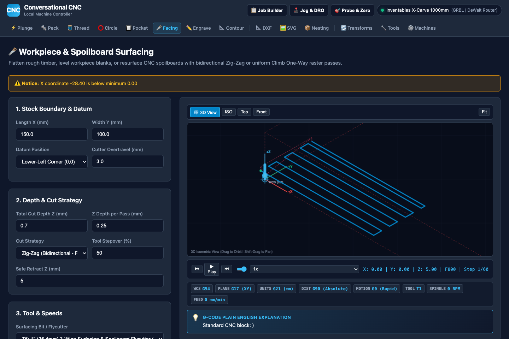

#### Card 1: Stock Dimensions & Placement
- **Stock Length X (mm)**: Total dimension of the area to be surfaced along the X-axis.
- **Stock Width Y (mm)**: Total dimension of the area to be surfaced along the Y-axis.
- **Origin Datum Reference**:
  - `Bottom-Left Corner (X0 Y0)`: Stock begins at $(0,0)$ and extends to $+X$ and $+Y$. Standard for raw stock clamped to the bed.
  - `Center of Workpiece (Xc Yc)`: $(0,0)$ is dead center of the area. Ideal when surfacing round blanks or referencing center-drilled stock.

#### Card 2: Depths & Stepdowns
- **Top of Stock Z (mm)**: Starting height (usually `0.0`).
- **Target Depth Z (mm)**: Final surfaced depth (e.g., `-0.5mm` to clean a warped board, or `-0.2mm` to skim a spoilboard).
- **Max Stepdown Z (mm/pass)**: Maximum axial cut depth taken per pass. If Target Depth is $-1.0\text{mm}$ and stepdown is $0.35\text{mm}$, the generator calculates 3 equal passes of $0.333\text{mm}$.
- **Safe Retract Z (mm)**: Clearance height above the stock for rapid repositioning moves (default `5.0mm`).

#### Card 3: Machining Strategy
- **Facing Strategy**:
  - `Zig-Zag (Bidirectional)`: Cuts back and forth continuously without lifting the cutter. **Fastest machining time.**
  - `One-Way (Climb Only)`: Cuts in one direction, lifts to Safe Z, rapids back to the beginning, and cuts again. **Best surface finish on figured wood and acrylics.**
- **Cut Direction**:
  - `Along X Axis`: Tool traverses left-to-right along the gantry. Recommended on wide machines to minimize Y-axis gantry movement.
  - `Along Y Axis`: Tool traverses front-to-back.
- **Radial Stepover (%)**: Percentage of the tool diameter shifted over each pass. Default is **50%** (e.g. 12.7mm on a 25.4mm bit) to prevent cutter scallop ridges.
- **Lead-In Overrun (mm)**: Distance the tool starts outside the stock before engaging material (default `2.0mm`), ensuring cutter enters at full feed rate rather than accelerating in the cut.

---

### 4.2 Rectangular & Circular Pocketing / Island Bosses

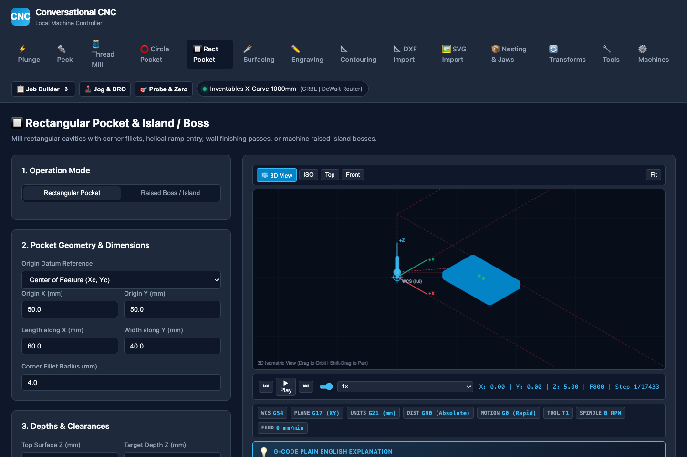

#### Card 1: Operation Mode
- `Pocket (Internal Cavity)`: Clears all material *inside* the programmed dimensions down to target depth.
- `Raised Boss / Island (Exterior Perimeter)`: Clears material *around* the outside of the shape down to target depth, leaving a raised rectangular or circular island.

#### Card 2: Pocket Geometry
- **Origin X & Y (mm)**: Coordinates of the pocket datum.
- **Length X & Width Y (mm)**: Cavity dimensions (for rectangular pockets).
- **Corner Fillet Radius (mm)**: Internal corner radius.
  > [!WARNING]
  > The corner radius **must be equal to or greater than the cutting tool radius** ($R \ge D_{tool}/2$). If you specify a 1.0mm fillet with a 3.175mm (1/8") bit (radius 1.5875mm), the tool physically cannot fit into the corner. Conversational CNC will alert you to increase the radius or select a smaller tool.
- **Diameter (mm)**: Hole / cavity diameter (for circular pockets).

#### Card 3: Machining Strategy & Entry
- **Entry Strategy**:
  - `Helical Ramp Entry (Recommended)`: The cutter ramps down in a continuous circular spiral at a gentle slope until reaching the target pass depth, then begins clearing outward. **Virtually eliminates cutter breakage and Z-axis stalling.**
  - `Direct Center Plunge`: Drops straight down in Z at the plunge feed rate. Only use with center-cutting endmills in soft materials.
- **Ramp Angle (°)**: Slope angle for the helical entry. Default **2.5°** for metals/plastics, **3.0°–4.0°** for softwoods.
- **Radial Stepover (%)**: Overlap percentage for clearing spirals (default **40%–50%**).
- **Finish Wall Stock (mm)**: Amount of material left on cavity walls during roughing (e.g. `0.2mm`). The generator removes this final skin in a dedicated full-depth finish pass at reduced feed rate for maximum dimensional accuracy.
- **Spring Pass**: Repeats the final perimeter finish pass at full depth without any additional stepover to remove tool deflection error.

---

### 4.3 2.5D Contouring, Holding Tabs & Lead-Ins

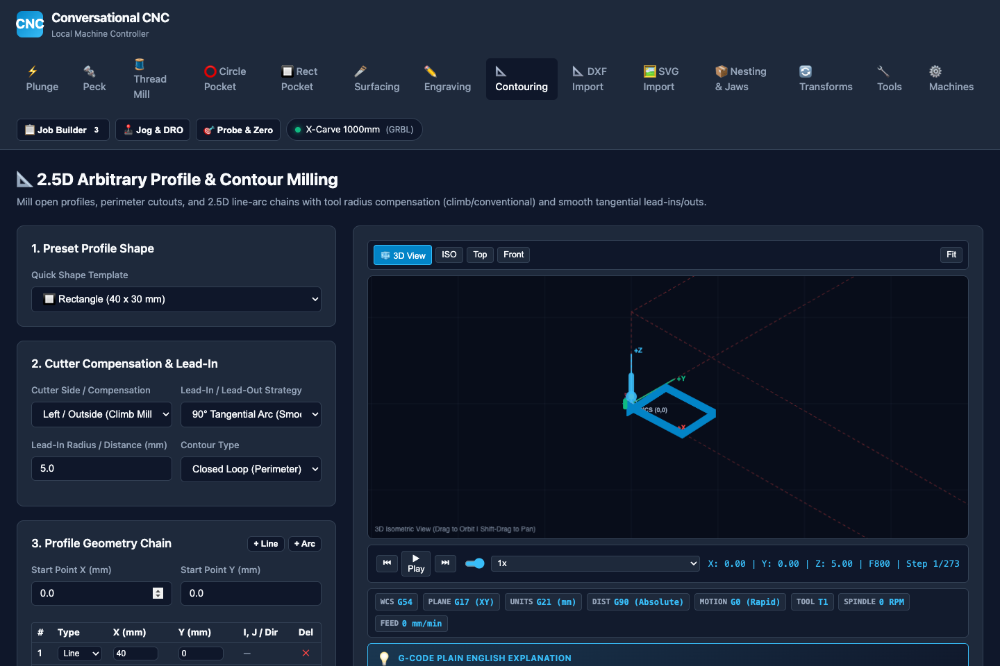

#### Card 1: Profile Shape & Chain
- **Preset Templates**: Fast generation of standard shapes (`Rectangle`, `Rounded Rectangle`, `Circle`, `Slot`).
- **Custom Line/Arc Segment Chain**: Define arbitrary perimeter cutouts by entering sequential $(X, Y)$ coordinate nodes and arc parameters (`G1 Line`, `G2 CW Arc`, `G3 CCW Arc`).

#### Card 2: Cutter Radius Compensation & Lead-Ins
- **Cutter Side / Compensation**:
  - `Left / Outside (Climb Milling)`: The tool offsets outward to the left of the path vector. Used for cutting parts out of stock with right-hand rotating cutters.
  - `Right / Inside (Conventional Milling)`: The tool offsets inward to the right of the path vector. Used for machining internal cutouts and holes.
  - `Centerline (No Compensation)`: Tool centerline follows the exact vector (kerf = tool diameter).
- **Lead-In / Lead-Out Strategy**:
  - `90° Tangential Arc`: Enters the cut along a smooth quarter-circle arc. Prevents dwell witness marks, gouging, and cutter deflection at the entry point.
  - `Straight Linear Tangent`: Approaches tangentially along a straight vector.
  - `Direct Plunge`: Drops straight down on the profile line.
- **Lead-In Radius (mm)**: Radius of the entry arc (default `5.0mm`).

#### Card 3: 3D Triangular Holding Tabs

Holding tabs prevent the part from coming loose and getting thrown by the spinning bit during the final cut pass.

| Setting Name | Default | What It Is & Recommended Value |
| :--- | :---: | :--- |
| **Enable Tabs** | `Checked` | Toggles holding tab generation on/off. |
| **Tab Count** | `4` | Number of tabs distributed evenly around the perimeter (minimum 2 on small parts, 4 to 8 on large sheet goods). |
| **Tab Width (mm)** | `6.0 mm` | Length of each tab along the cutting path (typically $5.0 - 8.0\text{mm}$). |
| **Tab Height / Thickness (mm)** | `1.5 mm` | Height of the tab bridge above the bottom cut depth ($1.0 - 2.0\text{mm}$ in wood, $0.5 - 1.0\text{mm}$ in aluminum). |
| **Tab Geometry** | `3D Triangular Ramp` | **Smooth 3D ramps up and down across the tab.** Unlike square tabs (which stop, lift Z, move XY, stop, and plunge Z), triangular tabs dynamically coordinate X, Y, and Z motion simultaneously, eliminating dwell marks and machine vibration. |

---

### 4.4 Straight Plunge & Deep Hole Peck Drilling

#### Card 1: Hole Pattern Layout
- `Single Hole`: Single $(X, Y)$ coordinate.
- `Grid Pattern Array`: Rectangular matrix defined by `Columns (X Count)`, `Rows (Y Count)`, `Pitch Spacing X`, and `Pitch Spacing Y`.
- `Bolt Hole Circle`: Circular bolt pattern defined by `Center X`, `Center Y`, `Circle Diameter`, `Number of Holes`, and `Start Angle (deg)`.

#### Card 2: Peck Drilling Parameters
- **Peck Increment (Q / mm)**: Maximum depth cut per plunge before retracting (e.g. `2.0mm`).
- **Retract Strategy**:
  - `Full Rapid Retract (Grbl Expanded / G83)`: Retracts completely out of the hole to Safe Z on every peck to clear packed chips and allow coolant/air to enter.
  - `Chip Break Dwell (G73)`: Retracts only $0.5\text{mm}$ to break the stringy chip before continuing down.
- **Bottom Dwell (sec)**: Pauses at the bottom of the hole for $0.5\text{s}$ to allow the drill tip to clean the bottom face before retracting.

---

### 4.5 Linear Slotting & Corner Chamfering

#### Linear Slots:
- **Slot Width (mm)**: If slot width equals tool diameter, outputs single-pass center slotting. If slot width is wider than tool diameter, automatically generates trochoidal offset passes.
- **Start $(X_1, Y_1)$ and End $(X_2, Y_2)$**: Endpoints of the slot centerline.

#### Corner & Edge Chamfering:
- **Chamfer Width (mm)**: Width of the bevel along the top face (e.g. `1.0mm`).
- **V-Bit Included Angle (deg)**: Angle of your chamfer tool (e.g. `60°`, `90°`).
- **Tip Diameter (mm)**: Flat tip width at the bottom of the V-bit.
- **Automated Z Depth Calculation**: Conversational CNC calculates the exact Z depth so the cutting edge engages the stock at its optimal cutting radius rather than dragging the fragile point.

---

### 4.6 Single-Point Helical Thread Milling

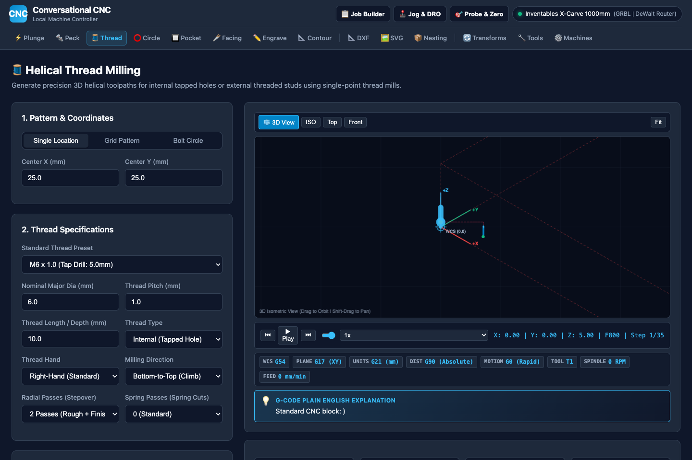

Thread milling cuts internal tapped threads or external studs with zero risk of broken taps:
- **Thread Standards Catalog**: Built-in pitch lookup for **ISO Metric** ($M2 \times 0.4$ to $M30 \times 3.5$) and **Unified National** ($4\text{-}40$ through $1\text{''}\text{-}12$ UNC/UNF).
- **Thread Type**: `Internal (Tapped Hole)` vs `External (Stud / Bolt)`.
- **Thread Length / Depth (mm)**: Total axial length of the threaded section.
- **Climb Bottom-to-Top Helical Direction**: Generates continuous helical arc blocks (`G2/G3 X.. Y.. Z.. I.. J..`). Cutting from the bottom of the hole upward pulls chips up and out of the cavity.

---

## 5. Vector CAD Importers (SVG & DXF)

---

### 5.1 SVG Importer with Grayscale Luminance-to-Depth Mapping

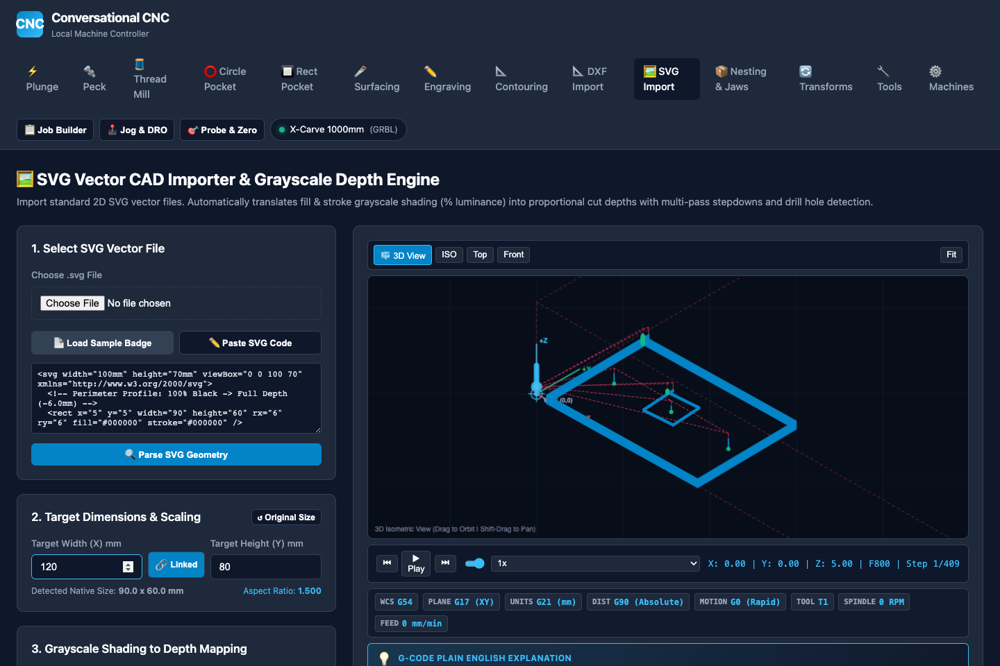

#### What It Does:
Standard SVG graphics contain no Z depth information. Conversational CNC analyzes the **color luminance (grayscale value)** of each shape and automatically calculates proportional cutting depths:

$$\text{Cut Depth} = \text{Max Cut Depth} \times (1.0 - \text{Luminance})$$

- **100% Black (`#000000`)** $\to$ **100% Max Cut Depth** (e.g. $-6.0\text{mm}$).
- **50% Gray (`#808080`)** $\to$ **50% Cut Depth** (e.g. $-3.0\text{mm}$).
- **25% Light Gray (`#C0C0C0`)** $\to$ **25% Cut Depth** (e.g. $-1.5\text{mm}$).
- **0% Pure White (`#FFFFFF`)** $\to$ **$0.0\text{mm}$ (No cut / Surface stock preserved)**.

#### Parameter Settings:
- **Target Dimensions & Scaling (Manual Width & Height)**:
  - **Target Width (X) mm & Target Height (Y) mm**: SVGs frequently have loose specifications, incorrect viewBox scales, or unit mismatches (such as 72 DPI vs 96 DPI). You can manually enter the exact physical width or height in millimeters.
  - **Aspect Ratio Link Toggle (`🔗 Linked` / `🔓 Unlinked`)**: **Enabled by default**. When linked, entering a new Width automatically recalculates and updates the Height proportionally (and vice versa) to prevent geometry distortion. Clicking the link button toggles to unlinked mode for independent, non-uniform X/Y scaling.
  - **`↺ Original Size` Button**: Instantly restores the SVG's native detected dimensions.
  - **Detected Native Size & Aspect Ratio**: Displays the original dimensions and exact aspect ratio ($W/H$) detected from the vector data.
- **Max Cut Depth (100% Black)**: The cut depth assigned to pure black paths (e.g. `-6.0mm`).
- **Color Evaluation Mode**:
  - `Fill Color`: Evaluates the interior fill shade of closed vector shapes.
  - `Stroke Color`: Evaluates outline stroke colors for line art.
- **Invert Shading**: Reverses mapping so pure white cuts deepest and black remains uncut.
- **Flip Y to CNC Cartesian**: Graphic SVGs use a top-down Y axis ($+Y$ goes down). Checking this box automatically mirrors vectors into standard CNC Cartesian space ($+Y$ goes up).

---

### 5.2 DXF 2D CAD Vector Importer & Automatic Closed Loops

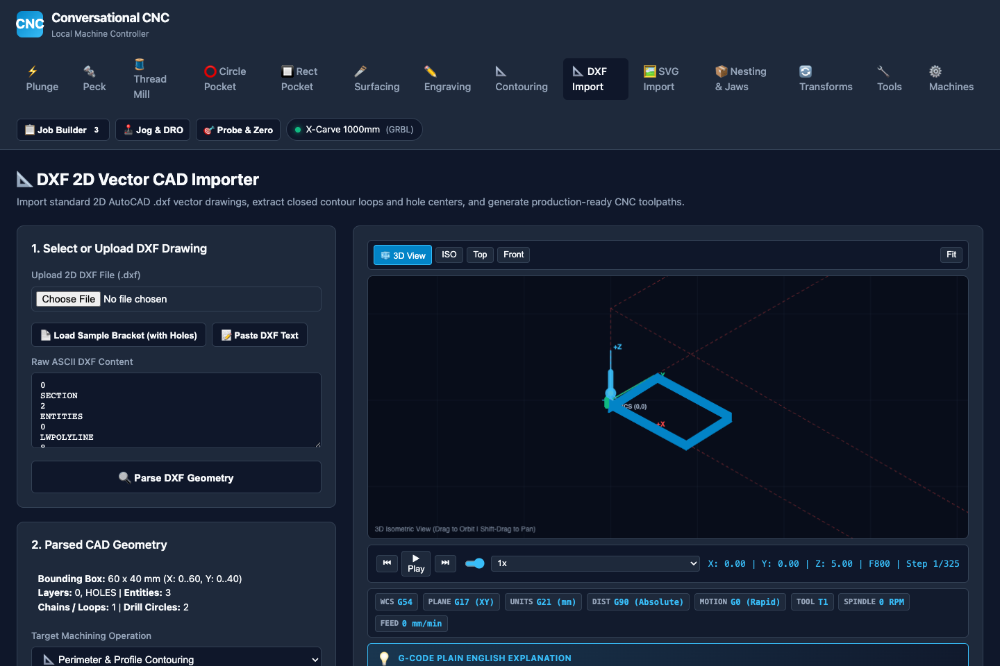

#### Supported Entities:
Parses AutoCAD R12 through 2024 ASCII DXF files containing `LINE`, `ARC`, `CIRCLE`, `LWPOLYLINE`, and `POLYLINE` entities.

#### Key Features:
- **Automatic Continuous Loop Chaining**: Automatically joins loose endpoint-to-endpoint line and arc segments into unified closed loops for climb contouring.
- **Hole / Drill Detection**: Circles matching tool diameter or flagged as holes are automatically routed to peck drilling cycles.
- **Layer Filtering**: Selectively toggle machining on or off for individual CAD layers (e.g. cut `PERIMETER` layer, drill `HOLES` layer, ignore `DIMENSIONS` layer).

---

## 6. Single-Line Hershey Typography & Text Engraving

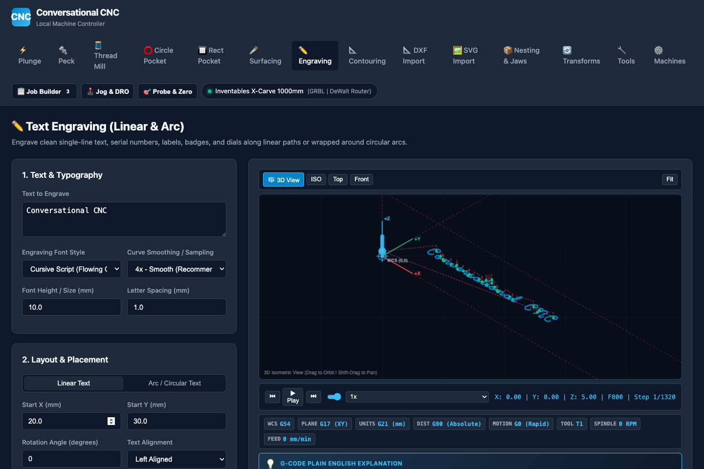

Standard TrueType/OpenType fonts contain closed outline perimeters that result in double-line cuts when engraved. Conversational CNC uses **Hershey Single-Stroke Vector Fonts** where the tool follows a single centerline stroke.

### Font Catalog:
1. **Cursive Script (`cursive_script`)**: Beautiful flowing handwritten cursive with natural baseline connectors and looped ascenders.
2. **Simplex Sans (`simplex_sans`)**: Clean, crisp single-stroke lettering for industrial tags and part numbers.
3. **Duplex Bold Sans (`duplex_sans`)**: Double-stroke weighted font for high-visibility signage.
4. **Roman Serif (`roman_serif`)**: Classic formal serifed lettering.
5. **Industrial Block (`block_stencil`)**: Chamfered 45° mechanical lettering for instrument panels.

### Text Layout Modes:
- **Linear Text**: Programmed with `Start X`, `Start Y`, `Rotation Angle (deg)`, and `Alignment (Left, Center, Right)`.
- **Arc / Circular Text**: Wraps text around a circle with `Arc Center X/Y`, `Arc Radius`, `Start Angle`, and `Convex (Top of Arc) vs Concave (Bottom of Arc)` orientation.

---

## 7. Nesting & Vise Soft Jaw Fixturing

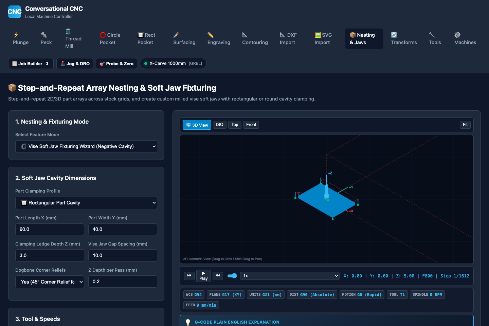

### Mode A: Step-and-Repeat Array Nesting
Repeats any active operation across a sheet stock matrix:
- **Grid Layout**: $M \times N$ columns and rows with custom pitch spacing.
- **Staggered / Honeycomb Layout**: Offsets alternating rows to pack circular parts tightly with up to 15% stock savings.

### Mode B: Vise Soft Jaw Cavity Generator
Machines custom aluminum or Delrin soft jaw fixtures to clamp irregular or second-operation parts in a standard machine vise:
- **Cavity Type**: `Rectangular Cavity` or `Circular Bore`.
- **Dogbone Corner Reliefs**: Automatically cuts 45° corner clearance fillets so square-cornered parts seat flush against jaw faces without corner interference.
- **Clearance Tolerance (mm)**: Adds a slight radial expansion (default `0.05mm`) for a smooth, slip-fit clamping grip.

---

## 8. Multi-Operation Job Builder & Tool Change Sequencer

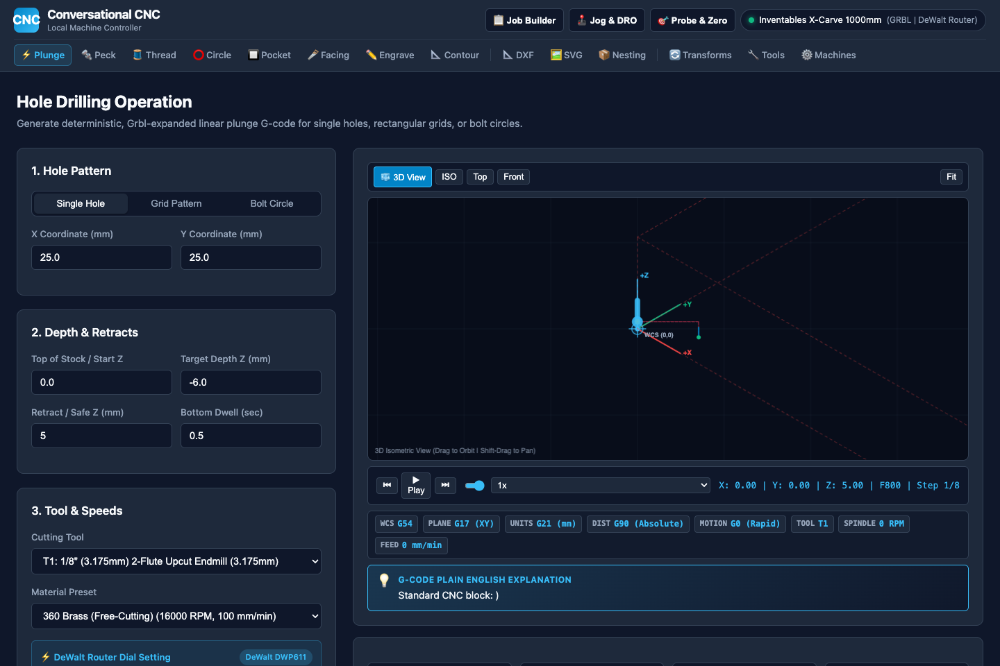

### How Job Sequencing Works:
1. Open any operational screen (e.g., *Surfacing*), dial in your parameters, and click **`➕ Queue Op`**.
2. Navigate to your next operation (e.g., *Rectangular Pocket*), configure parameters, and click **`➕ Queue Op`**.
3. Add your final perimeter cutout in *Contouring* and click **`➕ Queue Op`**.
4. Open the **`📋 Job Builder`** drawer from the top header.

### Automated Tool Change Engine:
When operations use different tools (e.g., Tool 6 flycutter $\to$ Tool 1 1/8" endmill):
- Automatically retracts Z to Safe Clearance.
- Turns off spindle (`M5`).
- Injects dialect-specific `M6 T..` tool change command.
- Adds operator prompt comments with target RPM and router speed dial settings.
- Restarts spindle (`M3 S..`) with programmed dwell delay (`G4 P2.0`) to let router reach full speed before engaging stock.

---

## 9. 3D WebGL Toolpath Inspector & Simulation Scrubber

Every screen features a synchronized 3D WebGL backplotter:

```
+-------------------------------------------------------------------------------+
|  3D BACKPLOTTER VISUAL ENVELOPE                                               |
|                                                                               |
|       🔴 Red Lines: Rapid Traverse Moves (G0 at Safe Z)                       |
|       🔵 Cyan Lines: Cutting Feed Moves (G1 / G2 / G3)                        |
|       🟡 Yellow Helices: Spiral Ramp Entry Motions                            |
|       🟢 Green Marker: Work Coordinate Origin (X0 Y0 Z0)                      |
|       🔲 Translucent Wireframe: Stock Bounding Envelope                       |
+-------------------------------------------------------------------------------+
|  [⏮ First]  [ ▶ Play / ⏸ Pause ]  [⏭ Last]  [=== Timeline Scrubber ===]     |
|  Live DRO: X: 50.00 | Y: 40.00 | Z: -2.00 | Feed: 800 mm/min | Step: 142/650 |
+-------------------------------------------------------------------------------+
```

### Camera Gestures:
- **Orbit**: Left-Click and drag.
- **Pan**: Right-Click (or Shift + Left-Click) and drag.
- **Zoom**: Scroll wheel.
- **View Reset Buttons**: `ISO (Isometric)`, `Top (XY Plane)`, `Front (XZ Plane)`, and `Fit Screen`.

---

## 10. End-to-End Machining Tutorials

---

### Tutorial 1: Spoilboard Flattening & Raw Stock Resurfacing

**Goal**: Cleanly flatten a $200\text{mm} \times 150\text{mm}$ warped walnut board using a 1" (25.4mm) surfacing flycutter.

1. **Mount Stock**: Secure the walnut board firmly to your CNC spoilboard using edge clamps or double-sided carpet tape.
2. **Set Origin**: Use the Jog Controller to jog the tool to the **front-left corner** of the board. Lower Z until touching the highest spot of the board. Click **`Zero XYZ`** in the Jog modal.
3. **Open Surfacing Tab**:
   - `Stock Length X`: `200.0`
   - `Stock Width Y`: `150.0`
   - `Origin Datum`: `Bottom-Left Corner (X0 Y0)`
   - `Top of Stock Z`: `0.0`
   - `Target Depth Z`: `-0.5` (taking a light 0.5mm flattening skim)
   - `Max Stepdown Z`: `0.35` (creates two shallow passes of 0.25mm)
   - `Facing Strategy`: `One-Way (Climb Only)` (provides the cleanest finish on hardwood)
   - `Cut Direction`: `Along X Axis`
   - `Stepover`: `50%` (12.7mm)
   - `Tool Selection`: `T6: 1" 3-Wing Flycutter`
   - `Router Speed`: `Dial 1 (16,000 RPM)`
4. **Generate & Verify**: Click **`⚡ Generate Surfacing G-Code & Preview`**. Verify the cyan backplot toolpaths cover the entire stock envelope.
5. **Run Cut**: Download `.nc` file, load into your machine sender (e.g. gSender, UGS, CNCjs), verify spindle is set to Dial 1, and press Cycle Start.

---

### Tutorial 2: Precision Bracket Cutout with Holding Tabs

**Goal**: Machine a $100\text{mm} \times 60\text{mm}$ aluminum bracket from 3.175mm (1/8") 6061 plate using holding tabs so the part doesn't fly loose.

1. **Workholding**: Clamp aluminum stock with sacrificial MDF backing board underneath.
2. **Zero Coordinates**: Use the Corner XYZ Touchplate to zero `X0 Y0 Z0` at the front-left corner.
3. **Open Contouring Tab**:
   - `Preset Shape`: `Rectangle (100 x 60 mm)`
   - `Corner Radius`: `4.0 mm`
   - `Cutter Side`: `Left / Outside (Climb Mill)`
   - `Lead-In Strategy`: `90° Tangential Arc (Radius: 4.0mm)`
   - `Top of Stock Z`: `0.0`
   - `Final Cut Depth Z`: `-3.4 mm` (cutting 0.225mm into spoilboard to ensure complete cutout)
   - `Max Stepdown Z`: `0.15 mm` (safe, conservative depth for belt-driven machines in aluminum)
   - `Enable Tabs`: `Checked`
   - `Tab Count`: `4`
   - `Tab Width`: `6.0 mm`
   - `Tab Height`: `0.8 mm`
   - `Tab Geometry`: `3D Triangular Ramp`
   - `Tool`: `T1: 1/8" 1-Flute Upcut Carbide Endmill`
   - `Material`: `6061-T6 Aluminum` (Feed: 250 mm/min, Plunge: 80 mm/min, Router Dial 1)
4. **Preview & Cut**: Verify 3D backplotter shows 4 triangular bridges rising 0.8mm above the bottom depth. Run program. After machining finishes, clip the 4 small tabs with flush cutters and deburr.

---

### Tutorial 3: Multi-Depth Badge Carving from SVG Graphic

**Goal**: Engrave an SVG logo with a black outer perimeter cut to $-3.0\text{mm}$, gray lettering pocketed to $-1.5\text{mm}$, and white background untouched.

1. **Prepare Artwork**: In Inkscape/Illustrator, style background as `#FFFFFF` (white), lettering as `#808080` (50% gray), and outer border as `#000000` (black). Save as standard SVG.
2. **Open SVG Tab**: Click **`Choose File`** (or click **`📄 Load Sample Badge`**).
3. **Set Parameters**:
   - `Max Cut Depth (100% Black)`: `-3.0 mm`
   - `Color Evaluation Mode`: `Fill Color (Shapes & Cavities)`
   - `Max Stepdown Z`: `1.0 mm` (black cuts take 3 passes of 1.0mm; gray cuts take 2 passes of 0.75mm)
   - `Lead-In Arc`: `90° Tangential Arc`
   - `Tool Selection`: `T1: 1/8" Endmill` (or 60° V-bit)
4. **Generate & Inspect**: Click **`⚡ Generate SVG G-Code & Preview`**. The multi-depth 3D backplotter will display stepped toolpath tiers corresponding directly to your artwork's shading.

---

*Conversational CNC — Precision machining simplified.*
