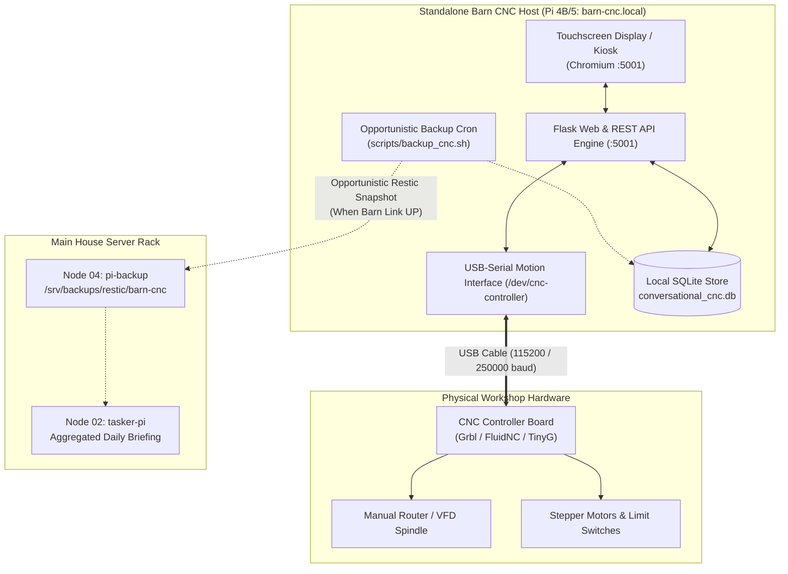

# Plan 01: Standalone Barn Workshop Raspberry Pi Deployment & Offline Motion Host

## 1. Goal Description
The **Conversational CNC Controller** must operate reliably in the physical workshop (Barn). Because the machine uses direct USB-serial communication (Grbl, FluidNC, TinyG) and the inter-building wireless network link between the barn and the main house is subject to packet loss and downtime during rain and storms, this plan establishes a **100% offline-first standalone deployment** on a dedicated Raspberry Pi 4B / Pi 5 located physically at the CNC machine.

### Core Objectives:
1. **Offline-First Autonomous Execution**:
   - Ensure the application runs 100% locally with zero hard runtime dependencies on external cloud APIs or main house server availability during active machining.
   - Local SQLite persistence for machine profiles, tool libraries, material feeds/speeds, and job logs.
2. **Deterministic USB-Serial Machine Connection**:
   - Install persistent udev rules (`/etc/udev/rules.d/99-cnc.rules`) creating predictable symlinks (`/dev/cnc-controller`) across device reboots and USB port replugs.
   - Configure low-latency FTDI/CH340/CP2102 serial polling loops.
3. **Turnkey Node Provisioning Standard (`scripts/bootstrap_node.sh`)**:
   - Provide a fully automated bootstrap script adhering to the workspace bare-metal standard:
     - Install system dependencies (`python3-venv`, `sqlite3`, `restic`, `curl`, `git`, `rsync`, `chromium-browser` for optional kiosk).
     - Build local Python virtual environment (`.venv/`).
     - Install and enable `conversational-cnc.service` systemd unit.
     - Configure optional local touchscreen autostart (Chromium kiosk mode pointing to `http://127.0.0.1:5001`).
4. **Opportunistic Remote Backup & Telemetry Sync**:
   - Script `scripts/backup_cnc.sh` to take atomic `VACUUM INTO` snapshots of local SQLite databases and push to Node 04 (`pi-backup.local:/srv/backups/restic/barn-cnc`) whenever the inter-building network link is online, queuing snapshots locally when offline.

---

## 2. Architecture & Workflow Diagram



---

## 3. Code Modifications

### 1. Provisioning & Operational Scripts (`Conversational-CNC-Controller/scripts/`)
- **`[NEW]`** `Conversational-CNC-Controller/scripts/bootstrap_node.sh`:
  - Turnkey provisioning script for fresh Raspberry Pi OS Lite / Desktop installations.
  - Installs packages, builds `.venv`, sets up systemd service, installs udev rules, and verifies local endpoint health on `:5001`.
- **`[NEW]`** `Conversational-CNC-Controller/scripts/setup_udev_rules.sh`:
  - Detects attached USB serial controllers (Vendor/Product IDs for CH340, CP2102, FTDI, STM32) and generates `/etc/udev/rules.d/99-cnc.rules`.
- **`[NEW]`** `Conversational-CNC-Controller/scripts/backup_cnc.sh`:
  - Executes atomic SQLite `VACUUM INTO` backup to local staging, tests reachability of `pi-backup.local`, and transfers snapshots via Restic/rsync when link is available.

### 2. Subsystem Deployment & Configuration Updates
- **`[MODIFY]`** [`Conversational-CNC-Controller/deploy.sh`](../deploy.sh):
  - Update default target host to `PI_HOST="${PI_HOST:-barn-cnc.local}"` while retaining `--dry-run` safety mode.
- **`[MODIFY]`** [`Conversational-CNC-Controller/ARCHITECTURE.md`](../ARCHITECTURE.md):
  - Document offline-first barn deployment architecture and USB-serial udev configuration.

### 3. Documentation (`Conversational-CNC-Controller/docs/`)
- **`[NEW]`** `Conversational-CNC-Controller/docs/BARN_PI_SETUP_GUIDE.md`:
  - Step-by-step physical setup instructions for the barn Pi (power, touchscreen mounting, USB cabling, noise isolation / ferrite chokes, and initial bootstrap).

---

## 4. Test Updates & Specifications

### 1. Subsystem Hermetic Tests
- **`[NEW]`** `Conversational-CNC-Controller/backend/tests/test_offline_resilience.py`:
  - `test_app_starts_without_internet()`: Validates that all routes, generators, and database operations execute cleanly with DNS/internet mocks disabled.
  - `test_database_backup_atomicity()`: Verifies `VACUUM INTO` backup routine operates without blocking active REST API reads/writes.
- **`[NEW]`** `Conversational-CNC-Controller/backend/tests/test_serial_port_detection.py`:
  - `test_detect_serial_ports_mock()`: Tests automatic detection and fallback between `/dev/cnc-controller`, `/dev/ttyUSB0`, and `/dev/ttyACM0`.

---

## 5. Documentation Updates

- [`Conversational-CNC-Controller/docs/BARN_PI_SETUP_GUIDE.md`](../docs/BARN_PI_SETUP_GUIDE.md): Physical hardware wiring and installation guide.
- [`Conversational-CNC-Controller/docs/plans/AGENTS.md`](AGENTS.md): Update Plan 01 status.
- [`docs/plans/AGENTS.md`](../../docs/plans/AGENTS.md): Update Master Macro Plan Registry with Plan M12.

---

## 6. Verification Plan

### Automated Tests
1. Run local subsystem tests:
   ```bash
   cd Conversational-CNC-Controller && ./run_tests.sh
   ```
2. Verify deployment script in dry-run mode:
   ```bash
   ./deploy.sh --dry-run
   ```
3. Run master workspace test suite:
   ```bash
   ./scripts/run_all_tests.sh
   ```

### Manual Verification
1. Review `BARN_PI_SETUP_GUIDE.md` for physical hardware, ferrite choke noise suppression, and power requirements.
2. Verify that `bootstrap_node.sh` is idempotent and ready for live execution once the physical barn hardware is mounted.
