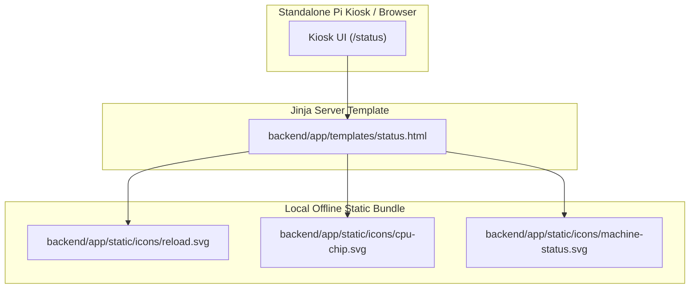

# Plan 02: Status Page Missing UI Icons Bug Fix

## 1. Goal Description
On the standalone CNC kiosk status dashboard (`/status`), several iconography elements (the manual refresh/reload icon, the system load indicator icon, and the machine connection status badge) fail to render or render as empty glyph boxes when running in offline/local kiosk mode without external CDN internet access.
This plan fixes the issue by:
1. Bundling clean, inline SVG iconography assets into the local static asset directory (`backend/app/static/icons/`).
2. Updating Jinja templates (`backend/app/templates/status.html`) to render local SVG icons directly instead of relying on external web fonts or missing font assets.
3. Adding regression tests ensuring all icon paths resolve locally and return HTTP 200 without network connectivity.

---

## 2. Architecture & Workflow Diagram



---

## 3. Code Modifications

### Frontend & Static Assets
- `[NEW]` `backend/app/static/icons/reload.svg`: Offline SVG vector icon for page and telemetry reload.
- `[NEW]` `backend/app/static/icons/cpu-chip.svg`: Offline SVG vector icon for system CPU load.
- `[NEW]` `backend/app/static/icons/machine-status.svg`: Offline SVG vector icon for GRBL/Smoothie connection status.
- `[MODIFY]` [`backend/app/templates/status.html`](../../backend/app/templates/status.html): Replace external icon font classes with local inline or static SVG references.

### Tests
- `[NEW]` `backend/tests/test_status_icons.py`: Hermetic unit test verifying all icon references in `status.html` exist on disk and serve valid XML/SVG payloads.

---

## 4. Test Updates & Specifications

### Test Harness (`backend/tests/test_status_icons.py`)
1. **`test_status_page_renders_offline_icons()`**:
   - Asserts GET `/status` contains no external `cdnjs.cloudflare.com` or `fontawesome` font links.
   - Asserts all `<svg>` or `` tags resolve to existing files on the filesystem.
2. **`test_icon_static_files_valid_svg()`**:
   - Reads `backend/app/static/icons/*.svg` and verifies each file starts with valid `<svg` tags with viewBox attributes.

---

## 5. Documentation Updates
- `[MODIFY]` [`Conversational-CNC-Controller/docs/plans/AGENTS.md`](AGENTS.md): Update Plan 02 status in registry and active execution queue.

---

## 6. Verification Plan

### Automated Tests:
```bash
./run_tests.sh
```

### Manual Verification:
1. Start CNC server: `.venv/bin/python run.py` (or `./run.sh`).
2. Open `http://localhost:5001/status` in browser.
3. Confirm reload button, CPU load indicator, and machine connection badge render crisp vector icons.
