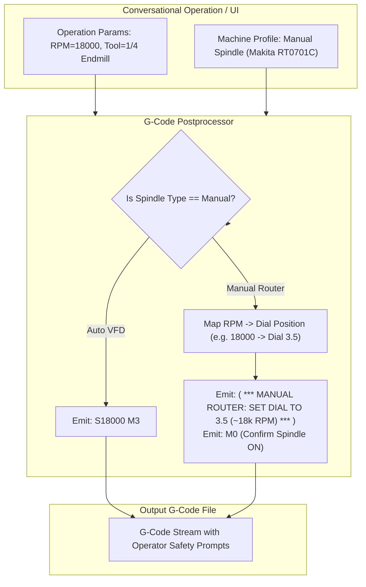

# Plan 03: Manual Spindle / Router Speed G-Code Commenting Mode

## 1. Goal Description
For CNC machines utilizing manual trim routers (such as a Makita RT0701C or DeWalt DWP611) instead of software-controlled variable-frequency drives (VFD), issuing automatic `S18000 M3` spindle start commands is ineffective and potentially dangerous if the operator forgets to turn on the physical router switch or set the correct RPM dial position.
This plan implements a **Manual Spindle Speed Commenting Mode** in the G-code postprocessor:
1. When a machine profile or conversational operation specifies a manual router, suppress raw `S... M3` commands.
2. In their place, emit explicit, high-visibility operator setup comments in the G-code header and tool change sections (e.g. `( *** MANUAL ROUTER: SET SPEED DIAL TO 3.5 [~18,000 RPM] BEFORE PRESSING CYCLE START *** )`).
3. Provide an optional `M0` (Program Pause / User Prompt) to require physical confirmation that the spindle is running before executing cut motion.

---

## 2. Architecture & Workflow Diagram



---

## 3. Code Modifications

### Postprocessor & Machine Models
- `[MODIFY]` [`backend/app/models/machine.py`](../../backend/app/models/machine.py): Add `spindle_type` enum (`VFD_AUTO`, `MANUAL_ROUTER`) and optional `router_model` mapping (e.g. `MAKITA_RT0701C`, `DEWALT_DWP611`).
- `[MODIFY]` [`backend/app/postprocessors/grbl.py`](../../backend/app/postprocessors/grbl.py): Update postprocessor to check `machine.spindle_type`; when manual, format RPM dial conversion comments and optional pause `M0`.
- `[NEW]` `backend/app/postprocessors/router_speed_tables.py`: Dial-to-RPM conversion mappings for standard manual routers (Makita 1–6 dial scale: 10k–30k RPM; DeWalt 1–6 dial scale: 16k–27k RPM).

### Tests
- `[NEW]` `backend/tests/test_manual_spindle_postprocessor.py`: Automated tests verifying G-code output contains dial comments and omits raw `S... M3` when manual router profile is selected.

---

## 4. Test Updates & Specifications

### Test Harness (`backend/tests/test_manual_spindle_postprocessor.py`)
1. **`test_manual_spindle_emits_dial_comment()`**:
   - Configures machine profile with `spindle_type = MANUAL_ROUTER` and `router_model = MAKITA_RT0701C`.
   - Requests G-code generation for a 16,000 RPM facing operation.
   - Asserts generated G-code contains `( *** MANUAL ROUTER: SET SPEED DIAL TO 2.8 (~16,000 RPM) *** )` and omits `M3 S16000`.
2. **`test_vfd_spindle_emits_standard_m3()`**:
   - Asserts standard VFD machine profiles continue emitting `S16000 M3` unchanged.

---

## 5. Documentation Updates
- `[MODIFY]` [`Conversational-CNC-Controller/docs/USER_GUIDE.md`](../USER_GUIDE.md): Document manual spindle speed dial conversion and operator safety prompts.
- `[MODIFY]` [`Conversational-CNC-Controller/docs/plans/AGENTS.md`](AGENTS.md): Update Plan 03 status.

---

## 6. Verification Plan

### Automated Tests:
```bash
./run_tests.sh
```

### Manual Verification:
1. Select a manual router profile in the UI.
2. Generate G-code for a pocketing operation.
3. Open the generated G-code viewer and verify prominent manual dial comments appear at the top and prior to tool engagement.
