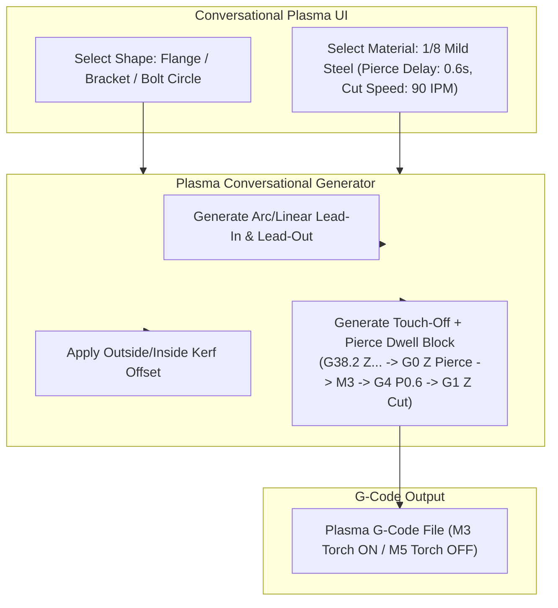

# Plan 04: Plasma Cutter CNC Machine Support & Conversational Generator

## 1. Goal Description
Expand the conversational CNC controller from rotary milling/routing to support 2D CNC plasma cutting operations. Plasma cutting involves distinct physical dynamics:
1. **Torch Triggering**: Fire torch with `M3` (relay closed) and extinguish with `M5` (relay open).
2. **Initial Height Sensing (IHS) & Pierce Delay**: Move torch down to plate touch-off, retract to pierce height, fire torch `M3`, dwell for pierce delay (`G4 P...` in seconds/ms based on sheet gauge), drop to cut height, and begin motion.
3. **Lead-In / Lead-Out Paths & Kerf Width Compensation**: Generate tangential/arc lead-ins to avoid pierce divots on finished edges, and apply kerf width offsets (e.g. 0.040" / 1.0mm) to cut geometry.

This plan implements a dedicated **Plasma Machine Profile** and **Plasma 2D Cut Generator** supporting DXF/conversational shapes (brackets, flanges, gussets, bolt hole patterns).

---

## 2. Architecture & Workflow Diagram



---

## 3. Code Modifications

### Backend Generators & Models
- `[NEW]` `backend/app/generators/plasma_2d.py`: Conversational 2D plasma path generator with pierce blocks, lead-ins, and kerf compensation.
- `[MODIFY]` [`backend/app/models/machine.py`](../../backend/app/models/machine.py): Add `PLASMA_CUTTER` machine type and plasma cut parameter tables (material type, sheet gauge, pierce height, cut height, pierce delay, IPM).
- `[NEW]` `backend/app/generators/plasma_feed_tables.py`: Material and gauge cutting charts (mild steel, aluminum, stainless 16ga to 1/2").

### Tests
- `[NEW]` `backend/tests/test_plasma_generator.py`: Automated tests verifying pierce sequence, `M3`/`M5` torch cycling, dwell `G4 P...`, lead-in arcs, and kerf compensation geometry.

---

## 4. Test Updates & Specifications

### Test Harness (`backend/tests/test_plasma_generator.py`)
1. **`test_plasma_pierce_sequence_generation()`**:
   - Asserts generated G-code includes initial pierce height move, `M3`, dwell `G4 P0.6`, drop to cut height, cutting feed moves, and `M5` torch off at contour completion.
2. **`test_plasma_kerf_compensation_outside_vs_inside()`**:
   - Asserts outside contours offset outward by half the kerf width ($+\frac{k}{2}$) and interior cutouts (bolt holes) offset inward ($-\frac{k}{2}$).

---

## 5. Documentation Updates
- `[MODIFY]` [`Conversational-CNC-Controller/docs/USER_MANUAL.md`](../USER_MANUAL.md): Document plasma cutting mode, cut charts, and lead-in parameter tuning.
- `[MODIFY]` [`Conversational-CNC-Controller/docs/plans/AGENTS.md`](AGENTS.md): Update Plan 04 status.

---

## 6. Verification Plan

### Automated Tests:
```bash
./run_tests.sh
```

### Manual Verification:
1. Select Plasma mode in the conversational interface.
2. Generate a 4-hole mounting flange from 10ga mild steel.
3. Review G-code visualizer to verify lead-in arcs, interior hole pierce sequences, and torch on/off timing.
