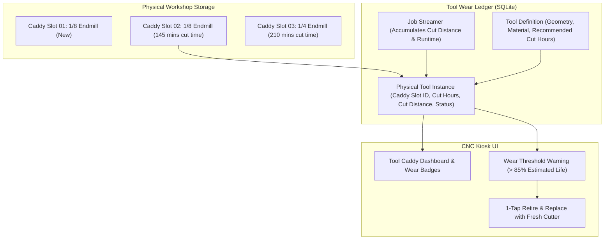

# Plan 06: Tool Life & Wear Tracking Ledger

## 1. Goal Description
Endmills, drill bits, and router cutters degrade over time through abrasive wear, edge chipping, and thermal breakdown. For bulk tools (such as boxes of small 1/8" or 1/4" straight endmills where individual cutters cannot be physically engraved with serial numbers), operators need a structured way to track specific tools based on their assigned physical location:
1. **Physical Tool Instance vs. Tool Definition**: Distinguish between the generic catalog tool definition (e.g. "1/8 Inch 2-Flute Carbide Upcut") and the physical tool instance identified by its numbered tool tray/caddy slot (e.g. `Slot 04`, `Collet Block B-2`) or collar color ring.
2. **Usage Accumulation**: Automatically accumulate engagement runtime (spindle on hours) and total cutting distance (meters/feet of cut feed) per physical instance across jobs.
3. **Wear & Retirement Alerts**: Warn operators when a specific physical cutter reaches its expected lifecycle threshold or allow 1-tap "Retire / Toss Tool" to log retirement and cycle in a fresh cutter from stock.

---

## 2. Architecture & Workflow Diagram



---

## 3. Code Modifications

### Backend Models & Ledger
- `[NEW]` `backend/app/models/tool_wear.py`: SQLAlchemy/SQLite models for `ToolDefinition` (nominal diameter, flute count, max life limit) and `PhysicalToolInstance` (caddy slot ID, accumulated cut minutes, total cut distance mm, wear status `ACTIVE`/`DULL`/`RETIRED`).
- `[MODIFY]` [`backend/app/api/tools.py`](../../backend/app/api/tools.py): Add `/api/tools/caddy` and `/api/tools/instance/<id>/retire` endpoints.
- `[NEW]` `backend/app/templates/tools_caddy.html`: Visual tool caddy grid layout showing physical slot positions with color-coded wear bars (Green $\rightarrow$ Yellow $\rightarrow$ Red).

### Tests
- `[NEW]` `backend/tests/test_tool_wear_ledger.py`: Automated tests verifying cut time accumulation, physical slot tracking, and lifecycle alert thresholds.

---

## 4. Test Updates & Specifications

### Test Harness (`backend/tests/test_tool_wear_ledger.py`)
1. **`test_tool_instance_cut_time_accumulation()`**:
   - Creates a physical tool instance in `Caddy Slot 03` assigned to a 1/8" Endmill definition.
   - Simulates streaming a 15-minute pocketing routine.
   - Asserts accumulated runtime increases by exactly 15 minutes and cut distance increases by total feed moves.
2. **`test_tool_retirement_and_replacement()`**:
   - Marks tool in `Slot 03` as `RETIRED`. Asserts status transitions and allows creating a fresh replacement instance in the same slot.

---

## 5. Documentation Updates
- `[MODIFY]` [`Conversational-CNC-Controller/docs/USER_MANUAL.md`](../USER_MANUAL.md): Document tool caddy numbering, wear tracking, and retirement workflows.
- `[MODIFY]` [`Conversational-CNC-Controller/docs/plans/AGENTS.md`](AGENTS.md): Update Plan 06 status.

---

## 6. Verification Plan

### Automated Tests:
```bash
./run_tests.sh
```

### Manual Verification:
1. Navigate to `/tools` on the CNC kiosk UI.
2. View the visual caddy grid; assign a cutter to Slot 01.
3. Simulate/stream a job and verify accumulated cutting minutes increase.
