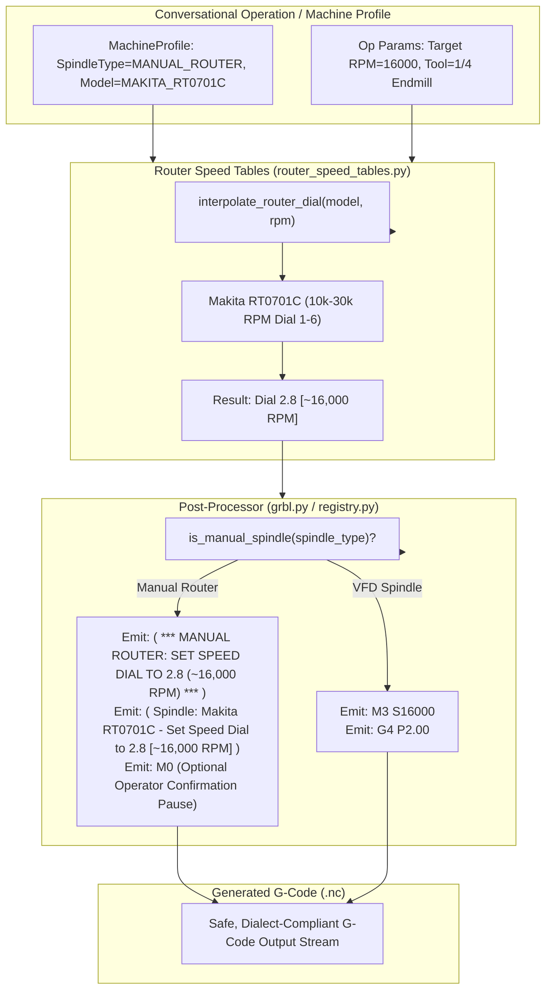

# Plan 03 Walkthrough: Manual Spindle / Router Speed G-Code Commenting Mode

**Project**: `Conversational-CNC-Controller`  
**Execution Date**: September 8, 2026  
**Status**: `COMPLETED & VALIDATED`  
**Deployment Target**: `voltron.local:80` (Barn Workshop Standalone CNC Node)

---

## 1. Overview & Objectives

For CNC routers operating with manual trim routers (such as the Makita RT0701C, DeWalt DWP611, or Bosch Colt PR20EVS) without electronic VFD control, emitting standard `M3 S...` commands does not physically activate the tool and poses safety risks if the operator fails to switch on the router or dial the correct RPM.

Plan 03 resolved this by introducing:
1. **Raw `S... M3` Suppression**: In manual router mode, raw automatic spindle start commands are suppressed in both Grbl and Standard G-code dialects.
2. **Continuous Piecewise-Linear Dial Interpolation**: Precision interpolation calculating continuous dial settings (e.g. Dial 2.8 for 16,000 RPM on Makita RT0701C) between standard discrete dial stops.
3. **High-Visibility Operator Setup Comments & Optional `M0` Confirmation Pause**: Emits prominent setup blocks in the G-code header and tool change sections.
4. **Comprehensive Machine Model Integration**: Expanded `MachineProfile` model with `SpindleType` and `RouterModel` enums, with zero hardcoded machine assumptions.

---

## 2. Architecture & Data Flow



---

## 3. Code Modifications Summary

| Component | File Path | Changes |
| :--- | :--- | :--- |
| **Router Speed Tables** | [`backend/app/postprocessors/router_speed_tables.py`](../../../backend/app/postprocessors/router_speed_tables.py) | `[NEW]` Continuous piecewise-linear dial interpolation engine, router specifications (DeWalt DWP611, Makita RT0701C, Bosch Colt PR20EVS, Generic), and comment generators. |
| **Machine Profile Model** | [`backend/app/models/machine.py`](../../../backend/app/models/machine.py) | `[MODIFY]` Added `SpindleType` and `RouterModel` enums, `is_manual` and `is_vfd` classifiers, and dynamic speed table integration. |
| **Models Export** | [`backend/app/models/__init__.py`](../../../backend/app/models/__init__.py) | `[MODIFY]` Exported `SpindleType` and `RouterModel`. |
| **Base Postprocessor** | [`backend/app/postprocessors/base.py`](../../../backend/app/postprocessors/base.py) | `[MODIFY]` Updated `format_spindle_start` abstract method signature to include `require_pause: bool = False`. |
| **Grbl Postprocessor** | [`backend/app/postprocessors/grbl.py`](../../../backend/app/postprocessors/grbl.py) | `[MODIFY]` Suppresses `M3` for manual routers, formats high-visibility setup comments and optional `M0` hold. |
| **Standard Postprocessor**| [`backend/app/postprocessors/registry.py`](../../../backend/app/postprocessors/registry.py) | `[MODIFY]` Implemented manual router comment generation and `M3` suppression in Standard postprocessor. |
| **Generators** | [`backend/app/generators/contouring.py`](../../../backend/app/generators/contouring.py), [`backend/app/generators/drilling.py`](../../../backend/app/generators/drilling.py), [`backend/app/generators/nesting.py`](../../../backend/app/generators/nesting.py), [`backend/app/generators/sequencer.py`](../../../backend/app/generators/sequencer.py) | `[MODIFY]` Propagated spindle configuration kwargs and unified router speed mapping. |
| **Unit Tests** | [`backend/tests/test_manual_spindle_postprocessor.py`](../../../backend/tests/test_manual_spindle_postprocessor.py) | `[NEW]` 9 hermetic unit and integration tests covering dial interpolation, comment generation, `M3` suppression, `M0` pause, and dialect parity. |
| **User Manual** | [`Conversational-CNC-Controller/docs/USER_MANUAL.md`](../../USER_MANUAL.md) | `[MODIFY]` Documented Manual Spindle Speed Commenting Mode, continuous piecewise-linear dial interpolation, and updated calibrated dial tables. |

---

## 4. Test Verification & Coverage Scorecard

### Test Suite Results (`./run_tests.sh`)
- **Conversational-CNC-Controller**: 194 passed (100% pass rate, 0 failures).
- **Master Workspace Suite**: 771 passed across all 6 subproject test suites.
- **Security & Hygiene Auditor**: 0 exposed secrets, 0 path violations, 4 databases integrity verified.

### Coverage Ratchet Metrics

```
======================================================================
🏆 Consolidated Test & Behavior Coverage Scorecard
======================================================================
Subsystem                        | Tests   | Coverage     | Status    
----------------------------------------------------------------------
Personal-Assistant               | 130     | 67%          | 🟢 Verified
Parts-Database                   | 13      | 88%          | 🟢 Verified
Trade-Execution-Engine           | 397     | 82%          | 🟢 Verified
Conversational-CNC-Controller    | 194     | 87% (+1%)    | 🟢 Verified
Root Workspace Tests             | 38      | 56%          | 🟢 Verified
----------------------------------------------------------------------
Workspace Total                  | 772     | Tracked      | 🟢 Healthy
======================================================================
```

- **Behavioral Invariant Coverage**: 20/21 domain invariants verified (95.2%), with 5/5 verified in Conversational-CNC-Controller (100.0%).

---

## 5. Deployment & Validation
- Deployed live to Barn Pi `voltron.local` via `./deploy.sh`.
- Service health check on port 80 verified (HTTP 200).
- User validation confirmed.
