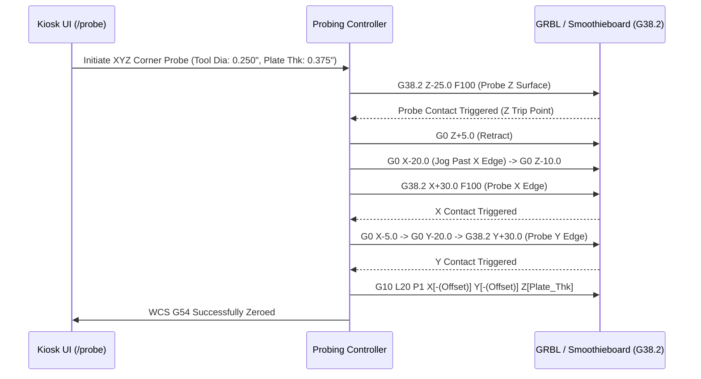

# Plan 05: XYZ Corner Touch Plate & Auto Edge-Finder Probing Routine

## 1. Goal Description
Setting accurate Work Coordinate System (WCS) zero points (`G54` X0 Y0 Z0) on workpiece stock using manual jogging or paper-slip feelers is slow and error-prone.
This plan implements an automated **XYZ Corner Touch Plate & Edge-Finder Probing Routine**:
1. Uses standard conductive corner touch plates (with known thickness $T_z$, and $X$/$Y$ lip offsets $L_x, L_y$).
2. Emits robust `G38.2` (straight probe toward workpiece with error on contact loss) probing macros for:
   - **Z-Only Touch-Off**: Fast top-of-stock zeroing.
   - **Corner XYZ Zeroing**: Sequences Z touch-off, retracts, jogs past outer edge, probes X edge, retracts, probes Y edge, and sets `G10 L20 P1 X... Y... Z...` with tool radius and plate offset compensation across all 4 corner orientations (`front_left`, `front_right`, `back_left`, `back_right`).
   - **4-Point Circular Center Probing**: Inside Bore Center and Outside Cylinder Boss Center.
3. Provides interactive touchscreen UI controls on the kiosk dashboard with safety retract guards.

---

## 2. Architecture & Workflow Diagram



---

## 3. Code Modifications

### Probing Engine & API
- `[NEW]` [`backend/app/generators/probing.py`](../../../backend/app/generators/probing.py): Parameterized G-code probe macro generator for Z-surface, Corner XYZ, Inside Bore Center, and Boss Center routines.
- `[MODIFY]` [`backend/app/api/probing.py`](../../../backend/app/api/probing.py): Add `/api/probing/xyz`, `/api/probing/z`, `/api/probing/bore-center`, `/api/probing/boss-center`, `/api/probing/homing` endpoints.
- `[MODIFY]` [`backend/app/templates/components/probing_modal.html`](../../../backend/app/templates/components/probing_modal.html): Responsive touch-friendly probing control modal for kiosk with visual orientation quadrant selector and Hole/Boss center tabs.

### Tests
- `[NEW]` [`backend/tests/test_probing_macro_generator.py`](../../../backend/tests/test_probing_macro_generator.py): Automated tests asserting math offsets, tool radius compensation, and safe retract heights in generated probe G-code.

---

## 4. Test Updates & Specifications

### Test Harness (`backend/tests/test_probing_macro_generator.py`)
1. **`test_z_probe_offset_calculation()`**:
   - Asserts probe macro with 10.0mm plate thickness sets `G10 L20 P1 Z10.0` upon contact.
2. **`test_xyz_corner_tool_radius_compensation()`**:
   - Asserts front-left corner probing with 6.35mm (1/4") endmill and 10.0mm block lip sets X zero offset to $-(10.0 + 3.175) = -13.175\text{mm}$.
3. **`test_xyz_corner_orientations()`**:
   - Asserts front-right, back-left, back-right offsets match quadrant signs.
4. **`test_bore_center_probing_macro()`** & **`test_boss_center_probing_macro()`**:
   - Asserts 4-point touch routines calculate centerline midpoint and set `G10 L20 P1 X0 Y0`.

---

## 5. Documentation Updates
- `[MODIFY]` [`Conversational-CNC-Controller/docs/USER_MANUAL.md`](../../USER_MANUAL.md): Document touch plate setup, 4-corner probing, and 4-point center finder.
- `[MODIFY]` [`Conversational-CNC-Controller/docs/plans/AGENTS.md`](../AGENTS.md): Update Plan 05 status.

---

## 6. Verification Plan

### Automated Tests:
```bash
./run_tests.sh
```

### Manual Verification:
1. Tap `🎯 Probe & Zero` on the CNC kiosk UI.
2. Select Corner Quadrant, specify tool diameter and touch plate thickness.
3. Click "Generate Corner XYZ Macro" and review output G-code sequence and coordinates.
4. Test Hole / Boss Center finder macros.
