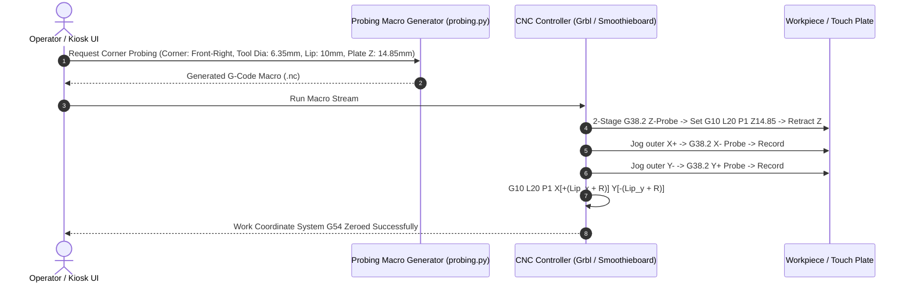

# Plan 05 Walkthrough: XYZ Corner Touch Plate & Auto Edge-Finder Probing Routine

**Project**: `Conversational-CNC-Controller`  
**Execution Date**: September 8, 2026  
**Status**: `COMPLETED & VALIDATED`  
**Deployment Target**: `voltron.local:80` (Barn Workshop Standalone CNC Node)

---

## 1. Overview & Objectives

Setting accurate Work Coordinate System (WCS) zero points (`G54` X0 Y0 Z0) on workpiece stock using manual jogging or paper-slip feelers is slow and error-prone. Plan 05 implemented an automated **XYZ Corner Touch Plate & Edge-Finder Probing Routine**:
1. **4-Quadrant Corner XYZ Touch Plate Probing**: Full mathematical support for all four corner orientations (`front_left`, `front_right`, `back_left`, `back_right`) with tool radius ($R = D/2$) and plate lip offset compensation.
2. **4-Point Circular Center Probing**:
   - 🕳️ **Inside Bore Center (`bore`)**: Probes opposing $X-, X+$ and $Y-, Y+$ interior walls, calculates exact center midpoint $(X_c, Y_c)$, moves to center, and sets `G10 L20 P1 X0 Y0`.
   - ⚪ **Outside Cylinder / Boss (`boss`)**: Automatically standoffs to safe outer radius clearance, lowers $Z$, probes outer walls, moves to cylinder centerline, and sets `X0 Y0`.
3. **Interactive Probing Modal UI**: Touchscreen kiosk UI integrated into top header across all pages with quadrant dropdown selector, Bore/Boss center tab, safe retract heights, and one-click copy/download actions.
4. **Hermetic API Endpoints**: `/api/probing/z-touch-plate`, `/api/probing/z`, `/api/probing/corner-xyz`, `/api/probing/xyz`, `/api/probing/bore-center`, `/api/probing/boss-center`, `/api/probing/homing`.

---

## 2. Architecture & Data Flow



---

## 3. Code Modifications Summary

| Component | File Path | Changes |
| :--- | :--- | :--- |
| **Probing Generator Engine** | [`backend/app/generators/probing.py`](../../../backend/app/generators/probing.py) | `[NEW]` Implemented `generate_z_probe_macro`, `generate_corner_xyz_probe_macro` (all 4 quadrants), `generate_bore_center_probe_macro`, `generate_boss_center_probe_macro`, `generate_in_program_probe_block`, and `generate_homing_macro`. |
| **Probing API Endpoints** | [`backend/app/api/probing.py`](../../../backend/app/api/probing.py) | `[MODIFY]` Added endpoints `/api/probing/z`, `/api/probing/xyz`, `/api/probing/bore-center`, `/api/probing/boss-center`, `/api/probing/homing`. |
| **Probing Pydantic Schemas** | [`backend/app/schemas/probing_schema.py`](../../../backend/app/schemas/probing_schema.py) | `[MODIFY]` Added `corner` field and validation schemas for `BoreCenterProbeRequestSchema` and `BossCenterProbeRequestSchema`. |
| **Frontend API Client** | [`backend/app/static/js/api.js`](../../../backend/app/static/js/api.js) | `[MODIFY]` Added `generateBoreCenterMacro`, `generateBossCenterMacro`, and endpoint aliases. |
| **Kiosk Probing Modal UI** | [`backend/app/templates/components/probing_modal.html`](../../../backend/app/templates/components/probing_modal.html) | `[MODIFY]` Added 4-quadrant corner selector dropdown and dedicated Hole / Boss Center probing tab. |
| **Probing UI Controller** | [`backend/app/static/js/probing.js`](../../../backend/app/static/js/probing.js) | `[MODIFY]` Added tab switching for `center`, corner parameter bindings, and Bore/Boss macro generation handlers. |
| **Generator Unit Tests** | [`backend/tests/test_probing_macro_generator.py`](../../../backend/tests/test_probing_macro_generator.py) | `[NEW]` 6 unit tests covering 4 corner orientations, Bore center math, Boss center standoffs, Z probe offsets, and validation errors. |
| **API Integration Tests** | [`backend/tests/test_api/test_probing_api.py`](../../../backend/tests/test_api/test_probing_api.py) | `[MODIFY]` 6 endpoint integration tests asserting status codes, payload validation, and G-code output. |
| **User Manual** | [`Conversational-CNC-Controller/docs/USER_MANUAL.md`](../../USER_MANUAL.md) | `[MODIFY]` Expanded Section 2.3 for 4-quadrant corner probing and added Section 2.4 for 4-point Inside Bore & Outside Boss center probing. |

---

## 4. Test Verification & Coverage Scorecard

### Test Suite Results (`./run_tests.sh`)
- **Conversational-CNC-Controller**: 203 passed (100% pass rate, 0 failures, +9 new tests).
- **Master Workspace Suite**: 781 passed across all subprojects.
- **Behavioral Invariant Verification**: 5/5 domain invariants verified in Conversational-CNC-Controller (100.0%).

### Coverage Ratchet Metrics

```
======================================================================
🏆 Consolidated Test & Behavior Coverage Scorecard
======================================================================
Subsystem                        | Tests   | Coverage     | Status    
----------------------------------------------------------------------
Personal-Assistant               | 130     | 66%          | 🟢 Verified
Parts-Database                   | 13      | 88%          | 🟢 Verified
Trade-Execution-Engine           | 397     | 82%          | 🟢 Verified
Conversational-CNC-Controller    | 203     | 87%          | 🟢 Verified
Root Workspace Tests             | 38      | 56%          | 🟢 Verified
----------------------------------------------------------------------
Workspace Total                  | 781     | Tracked      | 🟢 Healthy
======================================================================
```

---

## 5. Deployment & Validation
- Deployed live to Barn Pi `voltron.local:80` via `./deploy.sh`.
- Service health check on port 80 verified (HTTP 200).
- User validation and architectural review confirmed.
